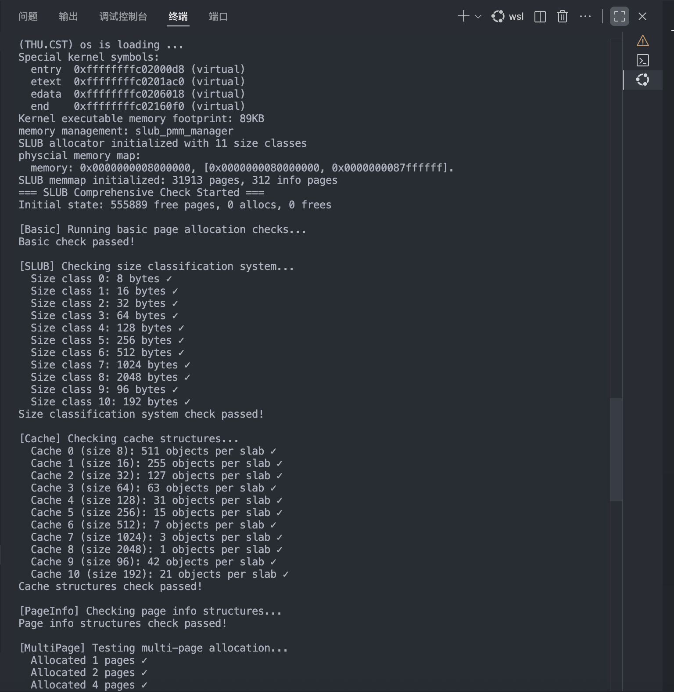
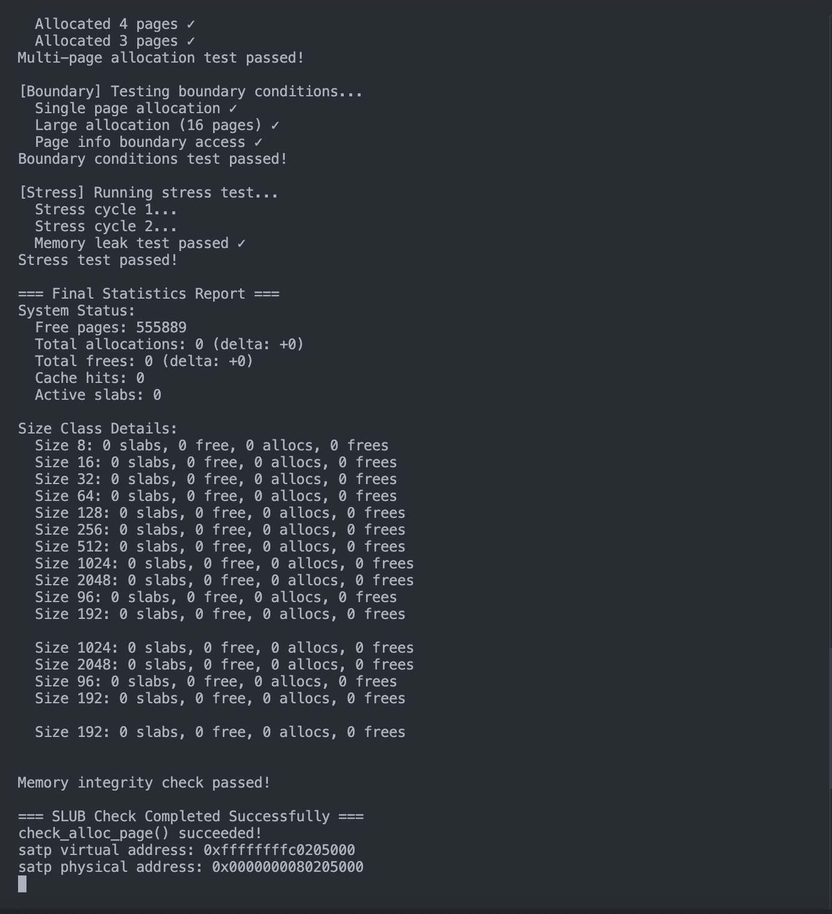

# lab2:物理内存和页表

## 练习1：理解first-fit 连续物理内存分配算法（思考题）

### （1）函数的功能分析

#### 1.default_init()

对于$default_pmm$管理器进行初始化的操作，为后续的物理内存的分配做准备。

#### 2.default_alloc_memmap(struct Page *base, size_t n)

​	这个函数是用来初始化物理页的管理表的函数，输入的参数是一段连续物理页的起始地址。n是这一次要初始化的页数。在判断了n合法之后，进行了页面管理信息的初始化（不是页面本身）。然后我们再将当前块的标签进行改变，最后插入free_list中。

​	我们分析之后可以看出，这是一个开辟新的空闲地址的操作。

#### 3.default_alloc_pages(size_t n)

​	该函数实现了first-fit物理页分配算法，即遍历空闲链表，找到第一个合适的块，分配后如果有剩余则拆分，维护链表和空闲页数，最后返回分配块的首地址。但是这个算法在遇见了n<nr_free但是并没有一整个块大于n的情况时还是会返回null，即first-fit算法只能分配连续的大块，会造成外部碎片的问题。所以需要下面这个函数。

#### 4.default_free_pages(struct Page *base, size_t n)

​	该函数实现了物理页的释放和空闲块合并。释放时先清空管理信息，然后插入空闲链表，最后尝试与前后相邻块合并，减少碎片。输入的参数和之前的一样，base是一段连续物理页的起始地址，n是这一次要释放的页数。前几部分的内容和alloc_memmap函数是大致相同的，只是在后面增接了一个检查是否为相连块的操作。

### （2）first-fit 算法改进空间

​	就像我们之前分析出来的一样，first-fit算法容易产生外部碎片（很多小块，导致大块分配失败）。同时查找效率随链表长度增加而降低。

改进方向：

合并空闲块：释放时更积极地合并相邻块，减少碎片。

或者采用练习二的best-fit/worst-fit：采用 best-fit 或 worst-fit 策略，进一步优化分配效率和碎片率。空闲块排序：对链表按块大小排序，分配时可更快找到合适块。

或者采用challenge的伙伴系统：采用伙伴系统等高级算法，支持高效合并和分割，进一步减少碎片。

## 练习2：实现 Best-Fit 连续物理内存分配算法（需要编程）

### （1）Best-Fit算法简析

best-fit（最佳适应）物理内存分配算法与first-fit类似，但分配时会在所有空闲块中选择“最小但足够”的块进行分配，从而减少大块被切割成小块、降低碎片率。

**核心实现思路：**

1. 遍历所有空闲块，找到满足要求（块大小 >= n）的最小块。
2. 分配该块，如果块比需求大，则拆分剩余部分重新插入链表。
3. 释放时与前后块合并，维护链表。

### （2）Best-Fit算法实现

```c
/*LAB2 EXERCISE 2: YOUR CODE*/ 
// 编写代码
// 1、当base < page时，找到第一个大于base的页，将base插入到它前面，并退出循环
// 2、当list_next(le) == &free_list时，若已经到达链表结尾，将base插入到链表尾部
if (base < page) {
    list_add_before(le, &(base->page_link));
    break;
} else if (list_next(le) == &free_list) {
    list_add(le, &(base->page_link));
}
```

首先这个部分和alloc_memmap函数，和first-fit的思想一致。

```c
size_t min_size = nr_free + 1;
/*LAB2 EXERCISE 2: YOUR CODE*/ 
// 下面的代码是first-fit的部分代码，请修改下面的代码改为best-fit
// 遍历空闲链表，查找满足需求的空闲页框
// 如果找到满足需求的页面，记录该页面以及当前找到的最小连续空闲页框数量

while ((le = list_next(le)) != &free_list) {
    struct Page *p = le2page(le, page_link);
    if (p->property >= n && p->property < min_size) {
        page = p;
        min_size = p->property;
    }
}
```

这个部分是best-fit和first-fit的不同之处，这里我们新定义了一个min-size使得我们能够记录当前最小的能够实现分配的块。

```c
/*LAB2 EXERCISE 2: YOUR CODE*/ 
// 编写代码
// 具体来说就是设置当前页块的属性为释放的页块数、并将当前页块标记为已分配状态、最后增加nr_free的值
base->property = n;
SetPageProperty(base);
nr_free += n;

/*LAB2 EXERCISE 2: YOUR CODE*/ 
// 编写代码
// 1、判断前面的空闲页块是否与当前页块是连续的，如果是连续的，则将当前页块合并到前面的空闲页块中
// 2、首先更新前一个空闲页块的大小，加上当前页块的大小
// 3、清除当前页块的属性标记，表示不再是空闲页块
// 4、从链表中删除当前页块
// 5、将指针指向前一个空闲页块，以便继续检查合并后的连续空闲页块
if (p + p->property == base) {
    p->property += base->property;
    ClearPageProperty(base);
    list_del(&(base->page_link));
    base = p;
}
```

这两处的代码个first-fit的主要思想也是也是一致的。按照提示对接口进行调用即可。

### （3）代码验证


我们在pmm.c里面对调用的管理器进行修改然后进行运行，可以看到输出了succeeded的输出，即我们的是正确的。

### （4）物理内存分配与释放流程

- 分配时，遍历所有空闲块，优先选择最适合（最小但足够）的块，减少大块被小请求切割，降低碎片率。
- 释放时，插入后自动尝试与前后块合并，保证空闲块尽量大且连续，便于后续分配。

### （5）代码改进空间分析

1.算法复杂度

当前实现每次分配都需遍历整个链表，时间复杂度 O(m)，m 为空闲块数。若空闲块较多，分配效率较低。可改进为：

1）用平衡树/堆等结构维护空闲块，按 property 快速查找最优块，提升分配效率。

2）维护双链表：一条按地址排序用于合并，一条按块大小排序用于分配。

2.内存碎片：Best-Fit 能有效减少大块被频繁切割，但仍可能产生大量小碎片。可进一步采用 Buddy System（伙伴系统）、Slab 分配等高级算法，动态合并和拆分，进一步降低碎片率。

3.空间利用率：当前每个页都需维护元数据，若页数极多，元数据占用空间也会增加。可通过优化元数据结构或批量管理提升空间利用率。


## 扩展练习Challenge：buddy system（伙伴系统）分配算法（需要编程）

### （1）buddy system的基本思想

伙伴系统（Buddy System）是一种用于内存管理的分配算法，主要用于减少内存碎片并提高分配和释放的效率。其基本思想如下：

1. 内存以2的幂次大小进行分割。例如，整个内存空间被分为若干块，每块大小为2^k。
2. 当需要分配一块内存时，系统会找到最小的、足够大的2的幂次块。如果没有正好合适的块，则将更大的块不断一分为二，直到得到合适大小的块。
3. 每次分割得到的两块称为“伙伴”（Buddy），它们在物理地址上是连续的。
4. 当释放内存时，系统会检查该块的伙伴是否也空闲。如果是，则将两块合并为更大的块，继续向上合并，直到不能再合并为止。
5. 通过这种方式，伙伴系统能够高效地进行内存分配和回收，减少外部碎片。

### （2）buddy system的基本设计

1.内存分级管理：

​	整个物理内存被分割为若干块，每块大小为2k2*k*页（k=0,1,...,MAX_ORDER *k*=0,1,...,*MAX*_*ORDER*）。

每种大小的块都有一个空闲链表（free list），如1页、2页、4页、8页……最大到2MAX_ORDER2*MAX*_*ORDER*页。

2.数据结构

`struct Page`：每个物理页的描述符，记录页状态、块大小等。

`free_area_t`：每个阶的空闲块链表，包含链表头和空闲块数量。

`free_lists[MAX_ORDER+1]`：所有阶的空闲链表数组。

整体架构图示例：

```
物理内存
└─ free_lists[0]：1页块链表
└─ free_lists[1]：2页块链表
└─ free_lists[2]：4页块链表
...
└─ free_lists[MAX_ORDER]：最大块链表

分配/释放流程
[请求n页] → [找到order] → [查找/分裂/分配] → [释放时合并伙伴]
```

### （3）buddy system的算法分析

buddy system的核心流程可以分为初始化、分配、释放与合并三大部分，下面按主要函数讲解：

1. 初始化（buddy_init 和 buddy_init_memmap）

buddy_init：初始化所有阶的空闲链表，把nr_free清零。

buddy_init_memmap：把所有物理页初始化为未分配状态，然后用贪心法把整个内存分割成尽可能大的2的幂次块，每个块挂到对应阶的空闲链表。

1. 分配（buddy_alloc_pages）

输入n页，先用get_order算出最小满足n的2的幂次order。从order阶开始查找空闲块，如果没有就往更高阶找，直到找到一个足够大的块。

如果找到的块比需要的大（current_order > order），就不断分裂：每次分裂出右半部分（buddy），挂到更低阶的空闲链表，直到分裂到刚好满足需求的order阶。最终返回分配的块指针。

1. 释放与合并（buddy_free_pages）

输入要释放的块和大小n，先用get_order算出order。把块属性和标志重置，挂到对应阶的空闲链表。

检查伙伴块（get_buddy），如果伙伴块也空闲且大小相同，则合并为更高阶块，继续尝试合并，直到不能再合并为止。最终把合并后的块挂到对应阶的空闲链表。

### （4）算法样例设计

首先测试的是我们的简单的分配与释放：分配1页和2页，断言分配成功，然后释放，测试最基本的分配和释放。

```
struct Page *simple1 = alloc_pages(1);
struct Page *simple2 = alloc_pages(2);
assert(simple1 != NULL && simple2 != NULL);
free_pages(simple1, 1);
free_pages(simple2, 2);
```

然后进行的是复杂的分配释放：

```
struct Page *complex1 = alloc_pages(3);
struct Page *complex2 = alloc_pages(5);
struct Page *complex3 = alloc_pages(7);
assert(complex1 != NULL && complex2 != NULL && complex3 != NULL);
free_pages(complex1, 3);
free_pages(complex2, 5);
free_pages(complex3, 7);
```

分配3、5、7页（不是2的幂），实际会分配到最近的2的幂（如4、8页），释放后测试伙伴合并机制。

接着进行的是伙伴系统的单元分配与释放：分配/释放1页，测试分配器对最小单位的支持。

```
struct Page *min_unit = alloc_pages(1);
assert(min_unit != NULL);
free_pages(min_unit, 1);
```

我们接下来测试的是最大单元分配释放：分配/释放最大支持的块（2^MAX_ORDER页），测试极限情况。

```
struct Page *max_unit = alloc_pages(1 << MAX_ORDER);
if (max_unit != NULL) {
    free_pages(max_unit, 1 << MAX_ORDER);
}
```

下一个测试的是伙伴系统的2的幂次分配和非2的幂次分配：分配1、2、4、8页，测试标准块分配。

```
struct Page *p1 = alloc_pages(1);
struct Page *p2 = alloc_pages(2);
struct Page *p4 = alloc_pages(4);
struct Page *p8 = alloc_pages(8);
assert(p1 != NULL && p2 != NULL && p4 != NULL && p8 != NULL);

struct Page *p3 = alloc_pages(3); // 实际分配4页
struct Page *p5 = alloc_pages(5); // 实际分配8页
assert(p3 != NULL && p5 != NULL);
```

我们选择释放前面分配的所有块，统计释放前后空闲页数，验证伙伴合并机制。

接着我们进行大块分配和边界情况检测：

```
struct Page *large = alloc_pages(64);
if (large != NULL) {
    free_pages(large, 64);
}

struct Page *huge = alloc_pages(1 << (MAX_ORDER + 1));
assert(huge == NULL);  // 应该失败
```

最后我们进行连续的分配和释放操作：连续分配10个单页，再全部释放，测试分配器在高频操作下的稳定性和正确性。

```
struct Page *pages_array[10];
for (int i = 0; i < 10; i++) {
    pages_array[i] = alloc_pages(1);
    assert(pages_array[i] != NULL);
}
for (int i = 0; i < 10; i++) {
    free_pages(pages_array[i], 1);
}
```

## Challenge2：slub算法实现
### 基本思想

SLUB（Simple List of Unused Blocks）算法是一种高效的内存分配器，主要用于管理小对象的分配和释放。其基本思想是通过以下机制优化性能：

1. **大小类别（Size Class）分类**：
   - 将内存分为多个固定大小的类别（如 8 字节、16 字节、32 字节等），每个类别对应一个 `slub_cache`。
   - 这种分类方式减少了内存碎片，提高了分配效率。

2. **CPU 缓存优化**：
   - 每个大小类别维护一个本地 CPU 缓存（`slub_cpu_cache`），用于快速分配和释放内存。
   - 本地缓存的使用避免了频繁访问全局数据结构，从而提高了并发性能。

3. **Slab 页面管理**：
   - 每个大小类别从 Slab 页面中分配对象，一个 Slab 页面包含多个相同大小的对象。
   - Slab 页面分为三种状态：完全空闲、部分使用和完全使用。
   - 部分使用的 Slab 页面通过链表（`partial_list`）管理，以便高效地复用未使用的对象。

4. **内存对齐和分配策略**：
   - 所有分配的内存块都按照 8 字节对齐，确保内存访问的高效性。
   - 使用 `first-fit` 策略分配页面，尽量减少内存浪费。

5. **统计信息和调试支持**：
   - SLUB 分配器维护了详细的统计信息（如分配次数、释放次数、缓存命中率等），便于性能分析和调试。

通过以上机制，SLUB 算法在保证高性能的同时，尽量减少了内存碎片，适用于频繁的小对象分配场景。


### 架构图

以下是 SLUB 算法的架构图，展示了其核心组件及其关系：

```plaintext
+-------------------+       +-------------------+
|   slub_allocator  |       |   slub_cache      |
|-------------------|       |-------------------|
| size_caches[11]   |<----->| object_size       |
| total_allocs      |       | objects_per_slab  |
| total_frees       |       | cpu_cache         |
| cache_hits        |       | partial_list      |
| nr_slabs          |       | nr_slabs          |
| page_infos        |       | nr_free           |
| max_pages         |       | nr_allocs         |
+-------------------+       | nr_frees          |
                               +-------------------+

+-------------------+
| slub_page_info    |
|-------------------|
| freelist          |
| inuse             |
| objects           |
| cache             |
| slab_list         |
+-------------------+

+-------------------+
| slub_cpu_cache    |
|-------------------|
| freelist          |
| avail             |
| limit             |
+-------------------+
```

**说明：**
- `slub_allocator` 是全局分配器，管理所有大小类别的缓存（`slub_cache`）。
- 每个 `slub_cache` 管理一种固定大小的对象，并通过 `partial_list` 维护部分使用的 Slab 页面。
- `slub_page_info` 描述每个 Slab 页的状态，包括空闲链表、已使用对象数等。
- `slub_cpu_cache` 是每个 CPU 的本地缓存，用于快速分配和释放内存。

### 数据结构

#### slub_cache

> slub算法中，我们一般有大小从$2^{3} - 2^{11},以及96和192$共11中存储对象的大小用来管理小内存的分配与释放。

该数据结构专门用于管理一种固定大小的对象。它拥有一些slab页面，这些slab页面中内存存储方式是对应的固定大小的对象。

其拥有的成员变量如下：

```c
size_t object_size;             // 对象大小
unsigned int objects_per_slab;  // 每slab对象数
struct slub_cpu_cache cpu_cache; // CPU缓存
list_entry_t partial_list;      // 部分空闲slab链表
size_t nr_slabs;                // slab总数
size_t nr_free;                 // 空闲对象数
size_t nr_allocs;               // 分配次数
size_t nr_frees;                // 释放次数
```

> 这里对于partial_list变量单独给出解释：slub算法中的slab页面一般有三种种类
>
> - 内部对象完全没有被分配过的页面
> - 部分被分配但仍有没有被使用的对象的页面
> - 所有内部对象均被使用过的页面
>
> 而这个链表用于管理该cache中的第二种页面。

#### slub_page_info

该数据结构用来管理slub算法中的页面的信息（slab页面的信息）

```c
void *freelist;                 // 页内空闲链表
unsigned int inuse;             // 已使用对象数
unsigned int objects;           // 总对象数
struct slub_cache *cache;       // 所属缓存
list_entry_t slab_list;         // 链表节点
```

同样，该数据结构的成员变量很好理解。

> 这里仅对slab_list变量给出解释，该变量是这个页面对应的链表节点的值，用于在链表中找到对应页面。

#### slub_cpu_cache

在多cpu的系统中，每个cpu在自己本地保存了一份cpu的缓存，用于存储cpu的本地运行信息。其中包含了这个cpu中的空闲页面的链表，可用页数量和最多的页数的数量。

#### slub_allocator

该数据结构用于全局分配slub_cache

```c
struct slub_cache *size_caches[SLUB_NUM_SIZES];
size_t total_allocs;
size_t total_frees;
size_t cache_hits;
size_t nr_slabs;
struct slub_page_info *page_infos;
size_t max_pages;
```

成员变量说明

1. **`size_caches`**:
   - 类型：`struct slub_cache *[SLUB_NUM_SIZES]`
   - 描述：一个数组，每个元素是一个指向 `slub_cache` 的指针。
   - 功能：存储所有大小类别（size class）的缓存，每个 `slub_cache` 管理一种固定大小的对象。
   - 工作机制：通过 `size_to_index` 函数将对象大小映射到数组索引，从而快速找到对应的 `slub_cache`。
2. **`total_allocs`**:
   - 类型：`size_t`
   - 描述：记录自分配器初始化以来的总分配次数。
   - 功能：用于统计分配器的使用情况，便于性能分析和调试。
3. **`total_frees`**:
   - 类型：`size_t`
   - 描述：记录自分配器初始化以来的总释放次数。
   - 功能：与 `total_allocs` 一起，用于计算内存分配和释放的平衡性。
4. **`cache_hits`**:
   - 类型：`size_t`
   - 描述：记录从 CPU 缓存（`cpu_cache`）中直接分配内存的次数。
   - 功能：反映缓存的命中率，命中率越高，分配器性能越好。
5. **`nr_slabs`**:
   - 类型：`size_t`
   - 描述：记录当前分配的 slab 页面总数。
   - 功能：用于统计分配器的内存使用情况。
6. **`page_infos`**:
   - 类型：`struct slub_page_info *`
   - 描述：指向一个数组，每个元素是一个 `slub_page_info` 结构，描述一个物理页面的状态。
   - 功能：记录所有页面的元信息，包括页面是否属于 slab、页面的使用情况等。
7. **`max_pages`**:
   - 类型：`size_t`
   - 描述：记录分配器管理的最大页面数。
   - 功能：用于限制分配器的管理范围，防止越界访问。

### 函数

#### slub_init

在这个函数中，我们对我们的slub分配器进行初始化，并把每一个处理固定大小对象的cache进行初始化处理。

> 这里，对于内存分配，我们开辟了一块静态内存池用于模拟内存分配管理
>
> ```c
> static char static_heap[PGSIZE * 16];
> static size_t heap_used = 0;
> ```

对于不同的对象大小的总数，我们设置有一个宏进行记录

```c
#define SLUB_NUM_SIZES      11   // 大小类别数量
```

然后我们遍历这个SLUB_NUM_SIZES变量，对于每一个固定的对象大小，使用自定义的静态分配内存的函数用于内存分配

```c
size_t size = index_to_size(i);

struct slub_cache *cache = static_alloc(sizeof(struct slub_cache));
if (!cache) continue;
```

这里的index_to_size是一个自定义的映射函数，从索引i映射到对应的块大小$2^i$,其实现可以见具体代码，这里不做展开讲解。

内存分配函数具体函数实现细节如下：

```c
static void *static_alloc(size_t size) {
    if (heap_used + size > sizeof(static_heap))
        return NULL;
    void *ptr = &static_heap[heap_used];
    heap_used = ((heap_used + size + 7) / 8) * 8;  // 8字节对齐
    return ptr;
}
```

> 这里没什么太多重点，唯一需要注意的是我们在return之前的最后一行进行了八字节对齐，从而避免额外的内存访问。

最后对cpu_cache和slub_cache进行了一些初始化设置。

```c
memset(cache, 0, sizeof(struct slub_cache));
cache->object_size = size;
cache->objects_per_slab = (PGSIZE - sizeof(void*)) / size;
if (cache->objects_per_slab == 0)
    cache->objects_per_slab = 1;

// 初始化链表
list_init(&cache->partial_list);

// 初始化CPU缓存
cache->cpu_cache.freelist = static_alloc(SLUB_CPU_CACHE_SIZE * sizeof(void*));
cache->cpu_cache.avail = 0;
cache->cpu_cache.limit = SLUB_CPU_CACHE_SIZE;

slub_allocator.size_caches[i] = cache;
```

#### slub_init_memmap

该函数的作用是使用分配器（`slub_allocator`）初始化页信息数组。

```c
 slub_allocator.page_infos = (struct slub_page_info *)page2kva(base);
```

使用传入的开始地址base，使用page2kva宏将其转化为虚拟地址之后，再强转为slub_page_info类型的指针，从而让slub_allocator的page_infos数组变量从base地址在虚拟地址的映射结果开始。

初始化过程中，涉及到两个变量：

- info_size：所有的page_info需要的总大小。
- info_pages：page_info需要的内容在内核中占多少个页。

定义了page_infos的开始地址后，我们将从这里开始的info_size个内存空间初始化为0，然后从物理空间的base + info_pages地址开始，将剩下页面设置为空闲。也就是清空了页面的保留状态、特殊属性、和引用计数。

```c
ClearPageReserved(p);
ClearPageProperty(p);
set_page_ref(p, 0);
```

#### slub_alloc_pages

该函数执行的作用是分配指定数量的页面。

在此函数中，我们用到了两个全局变量：

- pages 系统中所有物理页面的元数据
- npage 系统中物理页面的总页数

而函数的具体实现，实现的是简单的first_fit算法，在此不再赘述。

#### slub_free_pages

> 像init一样，将每个页面的保留位、特殊属性、引用位清零。

#### slub_nr_free_pages

> 在这个函数中，我们是用条件!PageReserved(pages + i) && !PageProperty(pages + i)来判断当前页面是否是空闲的页面，也就是不是保留页，且property为0.

### check

#### 1. `basic_check` 函数

`basic_check` 是一个基础检查函数，用于验证 SLUB 分配器的基本功能是否正常。它通过分配和释放页面来测试分配器的正确性。

**功能分析：**

1. **页面分配测试：**
   - 使用 `alloc_page` 分配三个页面 `p0`、`p1` 和 `p2`。
   - 确保分配的页面地址不重复，且引用计数为 0。
   - 验证分配的页面地址在合法范围内（通过 `page2pa` 检查物理地址）。

2. **释放测试：**
   - 使用 `free_page` 释放之前分配的页面。
   - 确保释放后可以重新分配相同的页面。

3. **空闲页面数量检查：**
   - 在释放页面前后，通过 `slub_nr_free_pages` 检查空闲页面数量是否正确变化。

**代码逻辑：**

- 通过断言（`assert`）确保每一步操作的正确性。
- 验证分配器的基本功能，包括页面分配、释放和引用计数的正确性。

**作用：**

- 确保分配器的基本功能正常，为后续更复杂的测试提供基础保障。

---

#### 2. `slub_check` 函数

`slub_check` 是一个全面的检查函数，用于验证 SLUB 分配器的所有核心功能，包括大小分类系统、缓存管理、页面管理和性能统计等。

**功能分析：**

1. **初始状态记录：**
   - 记录检查开始时的系统状态，包括空闲页面数、总分配次数和总释放次数。
   - 为后续的内存泄漏检测提供基准。

2. **基础功能验证：**
   - 调用 `basic_check` 验证分配器的基本页面分配和释放功能。

3. **SLUB大小分类系统检查：**
   - 验证11种大小类别（8, 16, 32, 64, 128, 256, 512, 1024, 2048, 96, 192字节）的正确映射。
   - 测试 `size_to_index` 和 `index_to_size` 函数的双向转换。
   - 验证边界条件处理，如最小值、特殊大小和超出范围的情况。

4. **缓存结构初始化检查：**
   - 验证每个大小类别的 `slub_cache` 结构正确初始化。
   - 检查对象大小、每slab对象数、CPU缓存限制等参数。
   - 确认partial链表和CPU缓存的初始状态。

5. **页面信息结构检查：**
   - 验证 `page_infos` 数组的正确初始化。
   - 检查页面信息结构的初始状态（空闲链表、使用计数等）。

6. **多页分配和释放测试：**
   - 测试不同大小的多页分配（1, 2, 4, 3页）。
   - 验证页面标志的正确设置（PageReserved）。
   - 确认分配和释放的正确性。

7. **边界条件测试：**
   - 测试单页分配和大块分配（16页）。
   - 验证页面信息边界访问的安全性。
   - 处理内存不足等异常情况。

8. **压力测试：**
   - 进行多轮快速分配和释放操作（15次循环，2轮测试）。
   - 测试不同大小的混合分配模式。
   - 检测内存泄漏和分配器的稳定性。

9. **统计信息验证和报告：**
   - 输出详细的系统状态报告，包括：
     - 空闲页面数和变化量
     - 总分配/释放次数和增量
     - 缓存命中次数和命中率
     - 活跃slab数量
   - 提供每个大小类别的详细统计信息。

10. **内存完整性检查：**
    - 比较检查前后的空闲页面数量。
    - 检测是否存在显著的内存泄漏。
    - 提供内存完整性验证结果。

**代码逻辑：**

- 采用分阶段测试策略，每个阶段都有明确的输出标识。
- 使用大量断言（`assert`）确保每一步操作的正确性。
- 提供详细的进度输出和错误报告。

**作用：**

- 全面验证SLUB分配器的所有核心功能。
- 提供详细的性能和状态分析数据。
- 检测内存泄漏和分配器稳定性问题。
- 为分配器的调试和优化提供数据支持。

---

#### 3.测试结果

以下是SLUB分配器的测试结果截图：

**SLUB检查测试第一部分：**


**SLUB检查测试第二部分：**


可以看到，我们的测试成功通过了，说明我们实现的slub算法可以正常的执行，也正确完成了其基本功能！
