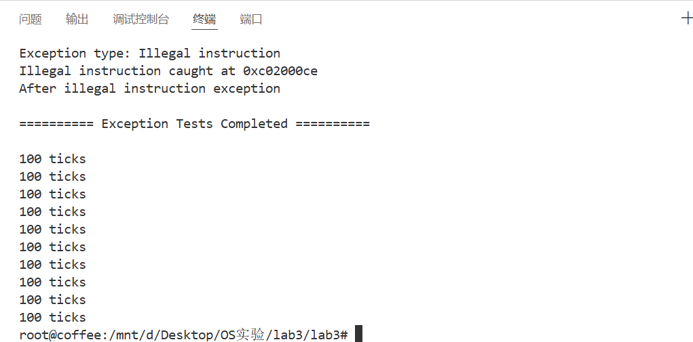
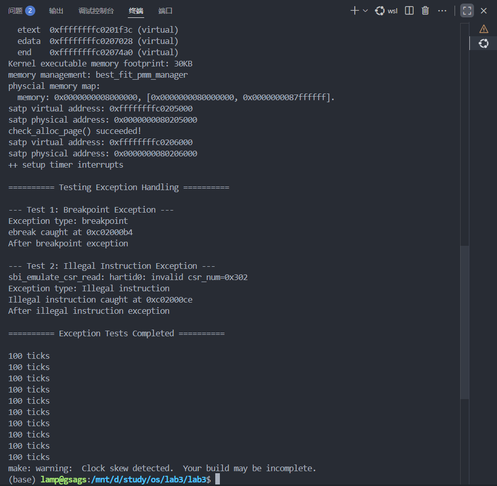

# Lab3：中断与中断处理流程

## 练习1：完善中断处理

### 实现过程

本实验在 `trap.c` 文件中完善了定时器中断的处理流程。主要步骤如下：

1. **设置下次时钟中断**：在 `interrupt_handler` 函数的 `IRQ_S_TIMER` 分支中，调用 `clock_set_next_event()`，确保时钟中断能够周期性触发。
2. **计数器自增**：每次进入时钟中断时，将全局变量 `ticks` 自增，记录中断次数。
3. **定期输出信息**：每当 `ticks` 达到 100 的倍数时，调用 `print_ticks()` 输出 "100 ticks" 信息，并将打印次数 `num` 自增。
4. **自动关机**：当打印次数 `num` 达到 10 时，调用 `sbi_shutdown()` 实现自动关机，防止系统无限循环输出。

```c++
clock_set_next_event();//发生这次时钟中断的时候，我们要设置下一次时钟中断
if (++ticks % TICK_NUM == 0) {
    print_ticks();
    num++; // 打印次数加一
    if (num == 10) {
        sbi_shutdown(); // 关机
    }
}
```

### 定时器中断处理流程

- 当定时器中断发生时，CPU 跳转到中断处理入口，保存现场后进入 `interrupt_handler`。

- 在`IRQ_S_TIMER`

   分支：

  1. 设置下次中断时间（`clock_set_next_event()`）。
  2. 增加 `ticks` 计数。
  3. 每 100 次中断输出一次提示信息。
  4. 达到 10 次输出后自动关机。

- 这样保证了时钟中断的周期性和实验的自动终止。

### 结果展示：

我们可以看到确实在打印了10个`100 ticks`之后，程序自己进行了中断。



------

## Challenge1：描述与理解中断流程

### 一、中断异常处理的完整流程

#### 1. 异常/中断的产生

- 当发生中断（如时钟中断）或异常（如非法指令、断点）时，CPU硬件自动做以下事情：
  - 将当前PC值保存到 `sepc` (Supervisor Exception Program Counter)
  - 将异常/中断原因保存到 `scause` 寄存器
  - 将出错地址保存到 `sbadaddr` 寄存器
  - 将当前状态保存到 `sstatus` 寄存器
  - 跳转到 `stvec` 寄存器指向的地址（即 `__alltraps`）

#### 2. 进入 `__alltraps` (trapentry.S)

```
__alltraps:
    SAVE_ALL              # 保存所有寄存器到栈中
    move  a0, sp          # 将栈指针sp赋值给a0
    jal trap              # 调用C函数trap()
```

#### 3. `SAVE_ALL` 宏展开（保存上下文）

```
csrw sscratch, sp         # 先将当前sp保存到sscratch
addi sp, sp, -36*REGBYTES # 在栈上分配36个寄存器大小的空间
STORE x0-x31...           # 保存32个通用寄存器
csrr s0-s4, CSRs...       # 读取CSR寄存器到通用寄存器
STORE s0-s4...            # 保存CSR寄存器值到栈
```

#### 4. 调用C函数(trap.c)

```
void trap(struct trapframe *tf) {
    trap_dispatch(tf);    # 根据tf->cause分发处理
}
```

#### 5. 分发到具体处理函数

 trap_dispatch()检查tf->cause的最高位：

- 最高位为1 → 中断 → `interrupt_handler()`
- 最高位为0 → 异常 → `exception_handler()`

### 二、`mov a0, sp` 的目的

作用：将trapframe结构体的地址作为参数传递给C函数

​	RISC-V调用约定：在RISC-V架构中，`a0` 寄存器用于传递函数的第一个参数。此时sp的含义：执行完 `SAVE_ALL` 后，`sp` 指向刚刚在栈上构造的 trapframe 结构体的起始地址。

### 三、SAVE_ALL中寄存器在栈中的位置是如何确定的？

由 trapframe 结构体的定义决定的，采用固定偏移量的方式

```c++
struct trapframe {
    struct pushregs gpr;  // 32个通用寄存器 (offset: 0-31*REGBYTES)
    uintptr_t status;     // sstatus (offset: 32*REGBYTES)
    uintptr_t epc;        // sepc    (offset: 33*REGBYTES)
    uintptr_t badvaddr;   // sbadaddr(offset: 34*REGBYTES)
    uintptr_t cause;      // scause  (offset: 35*REGBYTES)
};
```

### 四、是否所有中断都需要保存所有寄存器？

是的，在ucore的设计中，所有中断都需要保存所有寄存器。理由如下：

#### 1. 统一的中断入口

项目中只有一个中断入口 `__alltraps`，这意味着：无论是时钟中断、非法指令、断点等任何中断/异常都会执行同一个 `SAVE_ALL` 宏，无法针对不同中断类型做选择性保存。

#### 2. 无法预知中断处理的需求

时钟中断看起来只需要几个寄存器，但实际上

```c++
clock_set_next_event();  // 可能修改多个寄存器
cprintf("%d ticks\n");   // 函数调用会破坏临时寄存器
```

------

## Challenge2：理解上下文切换机制

#### `csrw sscratch, sp` 和 `csrrw s0, sscratch, x0` 实现了什么操作？

我们先来分析一下这两条指令实现的效果：

```asm
csrw sscratch, sp # 保存原先的栈顶指针到sscratch
```

这一条csrw指令的作用是对csr寄存器进行写入。功能是，将我们的用户将栈指针 `sp` 的值写入到 `sscratch` 寄存器中，临时保存中断发生时的栈顶指针。

```asm
csrrw s0, sscratch, x0
```

这是一个原子交换操作，将 `sscratch` 的值读到 `s0` 寄存器（此时 `s0` 得到了原来的 `sp` 值），同时将 `x0`（恒为0）写入 `sscratch`。取回之前保存的原始 `sp` 值，以便保存到 trapFrame 中。

要理解这两条指令，我们还要看下源代码，因为根据我们第一印象的理解，我们先将sp存入了sscratch中，然后又将sscratch存入了s0寄存器中。那么，我们会自然而然的想到一个问题：为什么我们不直接将sp存入s0寄存器中呢？

```asm
12 csrw sscratch, sp # 保存原先的栈顶指针到sscratch

addi sp, sp, -36 * REGBYTES # REGBYTES是riscv.h定义的常量，表示一个寄存器占据几个字节
# 让栈顶指针向低地址空间延伸 36个寄存器的空间，可以放下一个trapFrame结构体。
# 除了32个通用寄存器，我们还要保存4个和中断有关的CSR

# 依次保存32个通用寄存器。但栈顶指针需要特殊处理。
# 因为我们想在trapFrame里保存分配36个REGBYTES之前的sp
# 也就是保存之前写到sscratch里的sp的值
STORE x0, 0*REGBYTES(sp)
STORE x1, 1*REGBYTES(sp)
STORE x3, 3*REGBYTES(sp)
STORE x4, 4*REGBYTES(sp)
STORE x5, 5*REGBYTES(sp)
STORE x6, 6*REGBYTES(sp)
STORE x7, 7*REGBYTES(sp)
STORE x8, 8*REGBYTES(sp)
STORE x9, 9*REGBYTES(sp)
STORE x10, 10*REGBYTES(sp)
STORE x11, 11*REGBYTES(sp)
STORE x12, 12*REGBYTES(sp)
STORE x13, 13*REGBYTES(sp)
STORE x14, 14*REGBYTES(sp)
STORE x15, 15*REGBYTES(sp)
STORE x16, 16*REGBYTES(sp)
STORE x17, 17*REGBYTES(sp)
STORE x18, 18*REGBYTES(sp)
STORE x19, 19*REGBYTES(sp)
STORE x20, 20*REGBYTES(sp)
STORE x21, 21*REGBYTES(sp)
STORE x22, 22*REGBYTES(sp)
STORE x23, 23*REGBYTES(sp)
STORE x24, 24*REGBYTES(sp)
STORE x25, 25*REGBYTES(sp)
STORE x26, 26*REGBYTES(sp)
STORE x27, 27*REGBYTES(sp)
STORE x28, 28*REGBYTES(sp)
STORE x29, 29*REGBYTES(sp)
STORE x30, 30*REGBYTES(sp)
STORE x31, 31*REGBYTES(sp)
# RISCV不能直接从CSR写到内存, 需要csrr把CSR读取到通用寄存器，再从通用寄存器STORE到内存
csrrw s0, sscratch, x0
csrr s1, sstatus
csrr s2, sepc
csrr s3, sbadaddr
csrr s4, scause

STORE s0, 2*REGBYTES(sp)
STORE s1, 32*REGBYTES(sp)
STORE s2, 33*REGBYTES(sp)
STORE s3, 34*REGBYTES(sp)
STORE s4, 35*REGBYTES(sp)
.endm # 汇编宏定义结束
```

事实上，我们可以看到，在我们分析的两条指令中间，sp指针被下移了36个寄存器的位置，这事实上是开辟了一片新的36个寄存器的栈上空间，用来存储原先的寄存器的值的副本。这之后，我们才执行了`csrrw s0, sscratch, x0`这条命令。

也就是说，此时被sscratch中存储的栈指针的值覆盖的s0虽然还是s0寄存器，但是它原先存储的和用户空间运行相关的值已经被拷贝出来了一份副本，因此我们此时再对s0寄存器赋值，不会影响用户空间对s0的依赖。

这之后，我们将恒为0的x0寄存器的值赋给 sscratch，完成了对他的清零工作。

而这两个代码的最终作用，其实就是将sp的值拷贝到s0寄存器中，但是同时还要将原先用户空间运行时依赖的寄存器全部拷贝出一份副本出来。

**save all里面保存了stval scause这些csr，而在restore all里面却不还原它们？那这样store的意义何在呢？**

我们保存了这些csr，但restore里却不还原他们，究其原因，是因为这些寄存器是再异常/中断处理程序中才需要用到的背景信息，而当异常处理结束并回到用户空间之后，用户程序的运行并不需要这些寄存器保存的信息，所以我们不再需要还原这些寄存器的值。而store的意义就是保存一份副本出来，让异常处理程序能够可靠的执行。

***

## Challenge3：完善异常中断

### 实现思路

本扩展练习要求完善异常处理流程，能够正确捕获和处理非法指令异常和断点异常。具体实现如下：

1. **定位处理函数**：在 `trap.c`的 `exception_handler` 函数中，分别处理 `CAUSE_ILLEGAL_INSTRUCTION` 和 `CAUSE_BREAKPOINT` 两种异常。

   ```c
    case CAUSE_ILLEGAL_INSTRUCTION:
                // 非法指令异常处理
                /* LAB3 CHALLENGE3   2310137 :  */
               /*(1)输出指令异常类型（ Illegal instruction）
                *(2)输出异常指令地址
                *(3)更新 tf->epc寄存器
               */
               cprintf("Exception type: Illegal instruction\n");
               cprintf("Illegal instruction caught at 0x%08x\n", tf->epc);
               // 更新 epc 寄存器，跳过非法指令（假设指令长度为4字节）
               tf->epc += 4;
               break;
   ```

   这里，我们在遇到ILLEGAL_INSTRUCTION的时候，调用封装好的cprintf函数，并使用epc寄存器中的值，打印出题目中的要求：

   > 对于非法指令异常，输出 "Exception type: Illegal instruction" 和 "Illegal instruction caught at 0x(地址)"。

   之后，我们将epc寄存器的值+4（mret指令是32字节），前进到下一条指令的位置。

   ```asm
   case CAUSE_BREAKPOINT:
               //断点异常处理
               /* LAB3 CHALLLENGE3   2310137 :  */
               /*(1)输出指令异常类型（ breakpoint）
                *(2)输出异常指令地址
                *(3)更新 tf->epc寄存器
               */
               cprintf("Exception type: breakpoint\n");
               cprintf("ebreak caught at 0x%08x\n", tf->epc);
               // 更新 epc 寄存器，跳过断点指令（ebreak 指令长度为2字节）
               tf->epc += 2;
               break;
   ```

   对于断点类型，由于断点是16位指令，所以要在最后对epc+2来跳过这个指令。

2. **测试验证**：为了测试我们增加的处理逻辑是否生效，在 `init.c` 中插入 `ebreak` 和非法指令（代码中是 `mret`）

   ```asm
   // LAB3 CHALLENGE3: 测试异常处理
   cprintf("\n========== Testing Exception Handling ==========\n");
   
   // 测试断点异常 (ebreak)
   cprintf("\n--- Test 1: Breakpoint Exception ---\n");
   asm volatile("ebreak");
   cprintf("After breakpoint exception\n");
   
   // 测试非法指令异常 (mret 在 S 模式下是非法的)
   cprintf("\n--- Test 2: Illegal Instruction Exception ---\n");
   asm volatile(".word 0x30200073");  // mret 指令的机器码
   cprintf("After illegal instruction exception\n");
   
   cprintf("\n========== Exception Tests Completed ==========\n\n");
   ```

   ​	我们这里使用`asm volatile`直接嵌入mret和ebreak指令的机器码，即手动触发一个非法指令异常和断点异常。（这里选择mret指令异常的原因是在s模式下，该指令是非法的）。

   一切准备完毕后，运行`make qemu`，结果如下：

   

可以看到，我们的os正确识别了这两个类型的异常，并打印出了检测到异常的位置，说明我们增加的逻辑是正确的。

### 总结

通过本次实验的实现与调试，我对 RISC‑V 异常/中断处理的端到端流程有了系统且直观的理解。实践中，我实现并验证了从异常入口到 C 层分发再到具体处理函数的完整控制流，确认了汇编入口 `__alltraps` 在异常发生时通过 `SAVE_ALL` 将所有通用寄存器和关键 CSR（`sstatus`、`sepc`、`sbadaddr`、`scause`）保存到栈上的 `trapframe`，以及返回时 `RESTORE_ALL` 仅恢复必要的处理器状态并由 `sret` 返回到异常前的执行点的正确性。

在实验过程中，我明确了 CSR 的不同角色：部分寄存器用于恢复处理器状态（例如 `sepc` 和 `sstatus`），而另一些（如 `scause` 和 `sbadaddr`）主要用于内核在处理异常时的诊断与决策。掌握这一区分有助于在实现异常处理逻辑时只恢复必要的状态，同时能在内核中利用诊断信息进行准确的错误处理与日志输出。

通过在 `init.c` 中触发 `ebreak`（断点）和插入非法指令（mret 的机器码）进行测试，我观察到异常类型和发生地址被正确打印，且通过调整 `tf->epc` 成功跳过触发异常的指令，使程序在异常处理后继续执行。此外，定时器中断按预期每 100 次输出一次“100 ticks”，并在累积 10 次输出后通过 `sbi_shutdown()` 停止运行，说明中断计时与处理逻辑运行稳定。

此外，我还获得了一些实践方面的经验：编写低级异常处理代码时必须严格遵循保存顺序（先分配栈空间再保存寄存器），合理使用 `sscratch` 进行栈切换以保护用户态上下文；处理与指令长度相关的 `epc` 调整时需关注 RISC‑V 的 2/4 字节指令混合情形，必要时采用运行时判断来提高健壮性。总体而言，本次实验把理论概念与可运行的内核实现结合起来，加深了我对处理器与操作系统交互细节的理解，并为后续实现更复杂的进程切换、分页异常处理和系统调用功能奠定了坚实基础。