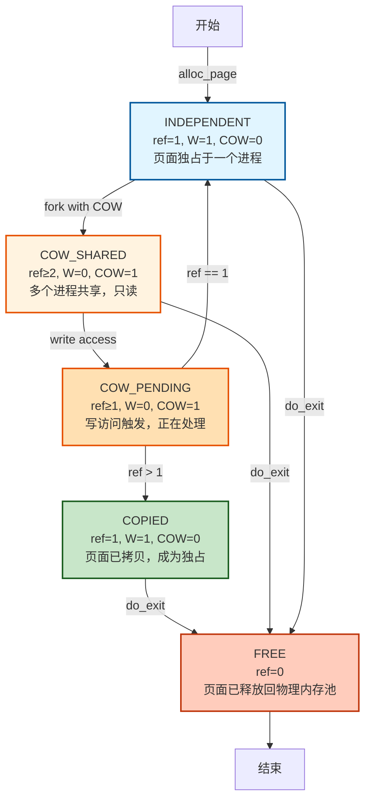
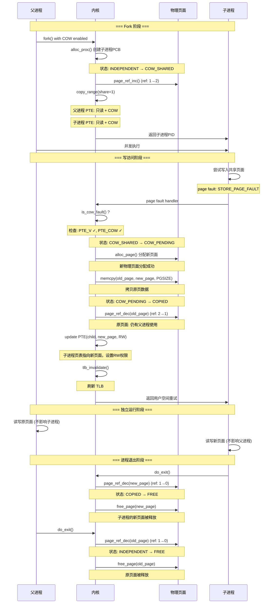
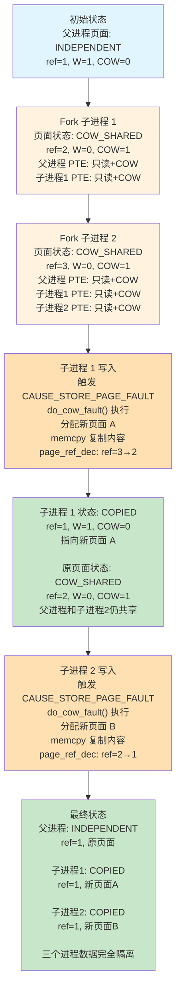

# 练习 1：加载应用程序并执行（需要编码）

## 一、实验目的

本实验要求补全 `load_icode` 中的**第 (6) 步**，即在加载用户程序` ELF `后，正确建立用户态进程的运行现场`（trapframe）`，包括设置：

- 用户栈指针 `sp`
- 程序入口地址 `epc`
- sstatus 寄存器，使其从内核态安全返回到用户态

确保进程第一次被调度执行时，能够从用户程序的第一条指令开始运行。

------

## 二、设计与实现过程说明

在 `load_icode` 的最后阶段，本次实验需要正确填充` trapframe`。在代码中补全的位置如下：

```c
tf->gpr.sp = USTACKTOP;
tf->epc = elf->e_entry;
tf->status = (sstatus & ~SSTATUS_SPP) | SSTATUS_SPIE;
```

下面逐项解释本次实现的设计依据与功能。

------

## **1. 设置用户栈指针（tf->gpr.sp）**

用户态程序运行时必须拥有一个合法的用户栈，本实验在内核中已经创建了用户栈区域：

```c
mm_map(mm, USTACKTOP - USTACKSIZE, USTACKSIZE, VM_READ | VM_WRITE | VM_STACK)
```

因此，只需让 trapframe 的 `sp` 指向用户栈顶：

```c
tf->gpr.sp = USTACKTOP;
```

设计原因：

- RISC-V 用户程序使用正常向下生长的栈，因此设置栈顶即可。
- 返回用户态时，硬件会使用该 sp 继续执行用户程序。

------

## **2. 设置程序入口地址（tf->epc）**

ELF 文件头中的 `e_entry` 字段即程序的第一条指令的虚拟地址：

```c
tf->epc = elf->e_entry;
```

设计原因：

- 当内核执行 `sret` 返回到用户态时，会从 epc 指定的位置开始运行。
- 若不设置或设置错误，用户程序无法启动。

------

## **3. 设置 sstatus（tf->status）**

我们的代码实现：

```c
tf->status = (sstatus & ~SSTATUS_SPP) | SSTATUS_SPIE;
```

含义解释如下：

### (1) 清除 SPP 位（Supervisor Previous Privilege）

```c
~SSTATUS_SPP
```

- `SPP=0` 表示当执行 `sret` 时返回 **用户态 U-mode**
- 若 `SPP=1` 则错误地返回 supervisor 内核态，导致不安全或崩溃。

### (2) 设置 `SPIE `位（Enable User Mode Interrupt）

```c
| SSTATUS_SPIE
```

- `SPIE=1` 表示用户态代码执行时允许中断。
- 这符合 `ucore` 用户进程的执行环境要求。

### (3) 保留其他 sstatus 位

我们的设计中：

```c
tf->status = (sstatus & ~SSTATUS_SPP) | SSTATUS_SPIE;
```

是正确的做法——即保留当前内核中的 `sstatus` 重要位，并仅修改用户态必须调整的部分。

------

## 三、实现流程总结

补全后的 `load_icode()` 做了三件关键任务：

1. **创建新的 mm 并构建页表**
2. **把 ELF 文件的代码段、数据段、BSS 等加载到用户态地址空间**
3. **构建 trapframe，使进程第一次运行能进入用户态从程序入口开始执行**

我们补写的 `trapframe `设置保证：

- 用户态栈已经准备完毕
- 程序入口地址正确写入
- `CPU `执行 `sret` 后会从 `U-mode `开始执行用户程序

至此，用户态进程具备了正确启动的所有必要条件。

------

## 四、从 RUNNING 状态到执行用户程序第一条指令的全过程

下面描述一次完整的过程，从进程被调度到真正执行 ELF 文件的第一条指令。

------

### **1. 进程被调度为 RUNNING**

调度器选择该进程：

```c
proc_run(p)
```

执行关键操作：

1. 切换页表：

   ```c
   lsatp(p->pgdir);
   ```

2. 切换 context（寄存器环境）：

   ```c
   switch_to(&prev->context, &p->context);
   ```

此时 CPU 已经进入该进程的内核栈，准备恢复其 trapframe。

------

### **2. 进入 forkret → forkrets → __trapret 流程**

`copy_thread()` 设置了：

```c
proc->context.ra = (uintptr_t)forkret;
proc->context.sp = (uintptr_t)proc->tf;
```

因此首次调度恢复该进程时：

- switch_to 会跳到 forkret()
- forkret 调用 forkrets(tf)
- forkrets 最终执行一个内联汇编，把 trapframe 加载到硬件寄存器

------

### **3. `sret` 从内核态返回到用户态**

关键动作：

- 设置 pc = tf->epc（即 ELF 的入口地址）
- 设置 sp = tf->gpr.sp（用户栈顶）
- 调整 sstatus，进入用户模式 U-mode

------

### **4. CPU 执行用户程序的第一条指令**

执行地址：

```
elf->e_entry
```

这就是用户程序的真正开始。

到此，用户态程序从 ELF 入口处正常启动运行。

## 五、总结

本实验在 `load_icode` 中补全了 `trapframe `的关键设置，使用户态程序具备正确启动的运行环境。通过设置用户栈、程序入口和 `sstatus，uCore `能够安全地从内核态切换到用户态，使得` ELF` 程序从第一条指令开始执行。

同时，本实验也帮助理解了：

- 用户态与内核态的切换机制
- `trapframe `保存与恢复的作用
- 进程第一次运行必须经过 `forkret → forkrets → sret` 的完整链路

# 练习二：父进程复制自己的内存空间给子进程（需要编码）

## 一、实验目的

本练习要求在 `do_fork` 创建子进程时，将父进程的用户态地址空间复制给子进程，使子进程获得一份独立但内容相同的内存空间。`uCore `中这一过程通过 `copy_mm → dup_mmap → copy_range` 完成，其中 `copy_range` 位于 `kern/mm/pmm.c`，需要我们补全按页复制的核心逻辑。

进一步地，实验还要求思考如何在此基础上设计` Copy-on-Write（COW）`机制，以减少 `fork `时的内存拷贝开销。

------

## 二、copy_range 实现过程说明

### 1. 整体思路

`copy_range` 的职责可以概括为一句话：

> 在虚拟地址区间 `[start, end)` 上，遍历父进程页表，如果某个虚拟页有效，则为子进程分配一个新的物理页，将父页内容拷贝过去，然后在子进程页表中建立相同权限的映射。

在我们的实现中，`share` 参数暂不使用（始终做“深拷贝”），即每个可访问的用户页都会在子进程中分配新的物理页，从而避免父子进程互相影响。

### 2. 关键实现步骤

补全部分核心代码如下（逻辑概括）：

```c
// 1. 找到父进程的页表项 ptep，并确认有效
pte_t *ptep = get_pte(from, start, 0);
...
if (*ptep & PTE_V) {
    // 2. 为子进程获取/创建对应的页表项 nptep
    nptep = get_pte(to, start, 1);

    // 3. 取出权限位 perm
    uint32_t perm = (*ptep & PTE_USER);

    // 4. 找到父进程物理页 page，并给子进程分配新页 npage
    struct Page *page = pte2page(*ptep);
    struct Page *npage = alloc_page();

    // 5. 通过 page2kva 将 Page 转换为内核虚拟地址，执行 memcpy
    void *src_kvaddr = page2kva(page);
    void *dst_kvaddr = page2kva(npage);
    memcpy(dst_kvaddr, src_kvaddr, PGSIZE);

    // 6. 调用 page_insert 将子进程的虚拟地址 start 映射到 npage
    ret = page_insert(to, npage, start, perm);
    if (ret != 0) {
        free_page(npage);
        return ret;
    }
}
```


可以分成下面几个关键点：

1. **遍历虚拟地址区间**
    每次以 `PGSIZE` 为步长遍历 `[start, end)`，并使用 `get_pte(from, start, 0)` 获取父进程当前虚拟页的` PTE`。
2. **跳过不存在的页**
    若 `ptep == NULL` 或该 `PTE `无效，则跳过整个大页/页表或当前页，继续下一个虚拟地址。
3. **复制页面内容**
    借助 `page2kva` 将 `Page` 对象映射到内核虚拟地址空间，使用 `memcpy` 将一整页`（4KB）`从父页复制到新分配的子页中。
4. **建立子进程的页表映射**
    使用 `page_insert(to, npage, start, perm)` 在子进程页表中建立 `start → npage` 的映射，并沿用父进程的用户权限位 (`PTE_USER` 所包含的 `PTE_U/PTE_R/PTE_W` 等)。如果 `page_insert` 失败，则释放 `npage` 并返回错误码，避免内存泄漏。

#### 3. 与整体 fork 流程的关系

在 `do_fork` 中，父进程为子进程复制内存空间的完整调用链为：

```c
do_fork
  └─ copy_mm
       ├─ mm_create / setup_pgdir    // 为子进程分配新的 mm 和页表
       └─ dup_mmap                   // 复制 VMA 结构
            └─ copy_range            // 按页复制实际数据
```


因此，`copy_range` 的正确性直接决定了子进程用户地址空间的正确性。我们的实现保证了：

- 父子进程的各个用户页内容一致；
- 但物理页是相互独立的，不会因为一方写入影响另一方。

------

## 三、Copy-on-Write 机制的实现

在当前实现中，`copy_range` 通过 `share` 参数支持两种模式：

1. **share = 0**：传统深拷贝模式，fork 时立即复制所有用户页
2. **share = 1**：COW 模式，fork 时共享页面，写时复制

### 3.1 COW 模式的启用

在 `dup_mmap()` 中，通过调用 `copy_range(to->pgdir, from->pgdir, vma->vm_start, vma->vm_end, share=1)` 启用 COW 机制。

**COW 的核心思想**：
- Fork 阶段**不真正复制物理页**，而是让父子进程共享同一物理页
- 只在页表层面做标记与权限调整
- 一旦发生写操作就会触发缺页异常，此时才进行真正的复制

### 3.2 COW 的关键标记与数据结构

**PTE 中的 COW 标记位**：
```c
#define PTE_COW 0x100  // 第 8 位作为 COW 标记
```

**Page 结构体中的引用计数**：
```c
struct Page {
    int ref;  // 页面被引用的次数
    // ...
};
```

**关键 API**：
- `page_ref_inc(page)` - 增加页面引用计数
- `page_ref_dec(page)` - 减少页面引用计数
- `page_ref(page)` - 获取页面引用计数值
- `set_page_ref(page, n)` - 设置页面引用计数为 n

### 3.3 Fork 阶段的 COW 建立

在 `copy_range()` 中，当 `share = 1` 时：

1. 遍历父进程的所有虚拟页
2. 对每个有效的页面：
   - 清除写权限：`perm & ~PTE_W`
   - 添加 COW 标记：`| PTE_COW`
   - 父子进程的 PTE 都指向同一个物理页
   - 增加页面引用计数：`page_ref_inc(page)`

这样，父子进程起初都只能"读共享页"，一旦发生写操作就会触发 COW 逻辑。

### 3.4 COW 缺页异常检测

当进程对一个 COW 页执行写操作时，硬件会产生"存储页故障"（CAUSE_STORE_PAGE_FAULT）。

在 `trap.c` 中的异常处理器会：
1. 检查异常是否为 `CAUSE_STORE_PAGE_FAULT`
2. 通过 `get_pte()` 取出对应 PTE
3. 检查是否设置了 `PTE_COW` 位
4. 若是 COW 页面，调用 `do_cow_fault()` 处理

### 3.5 COW 缺页处理流程

`do_cow_fault()` 是 COW 的核心函数，负责在写入时真正执行"写时复制"：

**处理步骤**：

1. **获取原始页面和权限**
   - 从 PTE 获取原物理页面
   - 恢复权限：移除 COW 标志，添加写权限

2. **检查引用计数**
   - 若 `page_ref(old_page) == 1`：只有当前进程使用
     - 直接恢复写权限，无需复制
     - 更新 PTE，刷新 TLB，返回
   - 若 `page_ref(old_page) > 1`：多个进程共享

3. **分配新页面并复制**
   - 分配新物理页面：`alloc_page()`
   - 复制原页面内容：`memcpy(dst, src, PGSIZE)`

4. **更新引用计数和页表**
   - 原页面引用计数减 1：`page_ref_dec(old_page)`
   - 若原页面引用计数为 0，释放该页面：`free_page(old_page)`
   - 新页面引用计数设为 1：`set_page_ref(new_page, 1)`
   - 更新 PTE 指向新页面，设置为可读写

5. **刷新 TLB**
   - `tlb_invalidate(mm->pgdir, addr)`
   - 使 CPU 缓存失效，确保内存一致性

处理完成后，该虚拟页在当前进程中已经变成一个"独占可写页"，而其他进程仍然共享原来的物理页。

### 3.6 进程退出时的资源清理

进程退出时，需要正确递减引用计数、释放物理内存。在 `exit_mmap()` 中：

- 遍历该进程的所有 VMA 和虚拟页
- 对每个有效 PTE：
  - 若带 `PTE_COW`，执行 `page_ref_dec(page)`，如果引用计数到 0 则 `free_page(page)`
  - 若不是 COW 页，则按普通独占页直接 `free_page(page)`

这样可以保证：
- 不会因为 COW 共享而产生内存泄漏
- 也不会错误释放仍被其他进程使用的共享页

------

## 四、小结

- 在本次实验中，我们通过实现 `copy_range` 完成了 **父进程到子进程的用户地址空间复制**，支持两种模式：
  - 传统深拷贝模式（share=0）
  - Copy-on-Write 模式（share=1）

- 在 COW 模式下，uCore 实现了：
  - PTE 层面的 `PTE_COW` 标记
  - Fork 阶段的页面共享与引用计数管理
  - 写缺页时的 `do_cow_fault()` 处理
  - 进程退出时的资源清理

- 这样一来，uCore 可以大幅降低 fork 的内存与时间开销，同时保持语义兼容，提高系统性能。

# 练习三：阅读分析源代码，理解进程执行 fork/exec/wait/exit 的实现，以及系统调用的实现（不需要编码）

## 1. **概述**

uCore 中的进程管理机制模仿 Linux 的简化模型，实现了进程创建、地址空间复制、程序加载、退出与等待等核心功能。其实现主要分布在 `proc.c`、`mm.c`、`pmm.c` 等文件中。
 系统调用 `fork/exec/wait/exit` 属于用户态可调用接口，但其核心逻辑完全在内核态完成，通过 **陷入（trap/ebreak）进入内核、修改 PCB、切换内核栈、页表、调度** 等机制实现。

以下将详细分析四个系统调用的执行流程，并回答题目要求的三个关键问题：

1. 哪些操作在用户态完成？
2. 哪些操作在内核态完成？
3. 用户态与内核态如何交错运行？
4. 内核态结果如何返回用户态？

## 2. **fork 执行流程分析**

### 2.1 用户态部分

用户程序调用 `fork()` → 编译器生成 `ecall/ebreak` → 触发异常进入内核：

```c++
pid = fork();
```

用户态做的事情非常少，只负责发起系统调用。

### 2.2 内核态执行流程（核心逻辑在 `do_fork`）

#### （1）创建 PCB

```c++
proc = alloc_proc();     // 分配并初始化 struct proc_struct
```

设置初始状态为 `PROC_UNINIT`。

#### （2）分配内核栈

```c++
setup_kstack(proc);
```

每个进程都有独立的内核栈。

（3）复制地址空间（或共享）

```c++
copy_mm(clone_flags, proc);
```

若普通 fork，则复制页表与所有 VMA：

```c++
dup_mmap(mm, oldmm);      // 复制映射关系
copy_range(...)           // 复制每个物理页的内容
```

#### （4）复制父进程 trapframe

```c++
copy_thread(proc, stack, tf);
```

并设置子进程返回值 `a0 = 0`（这是 fork 在子进程返回 0 的原因）。


#### （5）加入进程链表，设定父子关系

```c
set_links(proc);
```


#### （6）唤醒子进程

```c
wakeup_proc(proc);
```

子进程进入 `PROC_RUNNABLE`，等待调度。


**最终：返回给父进程子进程的 pid**

```c
return proc->pid;
```

## 3. exec 执行流程分析

`exec` 不创建新进程，而是在当前进程 **替换地址空间并执行新程序**。

### 3.1 用户态

用户程序调用：

```c
execve("/bin/ls", ...)
```

发起系统调用。

### 3.2 内核态执行流程（核心函数 `do_execve → load_icode`）

#### （1）销毁旧地址空间

```c
exit_mmap(mm);
put_pgdir(mm);
mm_destroy(mm);
```


#### （2）新建 mm、页表

```
mm_create();
setup_pgdir(mm);
```


#### （3）加载 ELF 文件到进程内存

核心代码：

```
for each LOAD 段:
    mm_map(...)
    分配物理页 pgdir_alloc_page(...)
    拷贝文件到内存 memcpy(...)
    构造 BSS 段 memset(...)

```


#### （4）分配用户栈


#### （5）设置 trapframe，使进程返回用户态

```c
tf->gpr.sp = USTACKTOP;
tf->epc = elf->e_entry;     // ELF 程序入口
tf->status = 设置为用户态可执行的 sstatus

```


#### （6）调度后恢复时会从新程序入口执行

## 4. wait 执行流程分析

等待子进程结束，并回收资源。

### 内核态流程（`do_wait`）

#### （1）检查目标子进程是否存在并是否已经 ZOMBIE

```c
proc = find_proc(pid);
if (proc->state == PROC_ZOMBIE) goto found;
```

若未退出，则：

#### （2）父进程进入 SLEEPING 状态

```c
current->state = PROC_SLEEPING;
current->wait_state = WT_CHILD;
schedule();   // 让出 CPU
```


#### （3）当子进程 exit 时，会唤醒父进程

```c
wakeup_proc(parent);
```


#### （4）父进程回收子进程资源

```c
unhash_proc(proc);
remove_links(proc);
put_kstack(proc);
kfree(proc);
```


## 5. exit 执行流程分析

进程退出：

### 内核态执行流程（`do_exit`）

#### （1）清理地址空间

```c
exit_mmap(mm);
put_pgdir(mm);
mm_destroy(mm);
```

#### （2）设置为 ZOMBIE 状态

```
current->state = PROC_ZOMBIE;
current->exit_code = error_code;

```

#### （3）重新设置子进程的父亲为 init

保证孤儿进程不会丢失。

#### （4）唤醒父进程

```c
wakeup_proc(parent);
```

#### （5）调度离开，不再返回

```c
schedule();
panic("should not return");
```

## 6. 用户态与内核态的交错执行机制

以下步骤普遍适用于 fork/exec/wait/exit：

### （1）用户态通过 ecall/ebreak 发起系统调用

CSR 保存用户态寄存器 → 切换到内核态。

------

###  （2）内核态执行具体逻辑

如 `do_fork/do_execve/do_wait/do_exit`。

------

###  （3）内核态将结果写入 trapframe（例如返回值放到 a0）

例如：

```c
proc->tf->gpr.a0 = 0;  // 子进程 fork 返回值
```

### （4） 通过 schedule 和 switch_to 切换进程

恢复时再次执行 `sret` 返回到用户态执行下一条指令。

### （5）用户态获得系统调用返回值

例如：

```c
pid = fork();    // 内核已经把返回值写进 a0
```


## 7. 一个用户态进程的生命周期状态图（字符图）

```c
                     +------------------+
                     |   PROC_UNINIT    |
                     |  alloc_proc()    |
                     +---------+--------+
                               |
                               v
                     +------------------+
                     |  PROC_RUNNABLE   |<---------------------------+
                     |  ready to run    |                            |
                     +----+-------+-----+                            |
                          |       |                                  |
            schedule()    |       |  wakeup_proc()                   |
                          v       |                                  |
                     +------------------+                             |
                     |   PROC_SLEEPING  |---- do_wait(), sleep() ----+
                     +------------------+
                               |
                               | child exit / wakeup_proc()
                               v
                     +------------------+
                     |   PROC_RUNNABLE  |
                     +---------+--------+
                               |
                               |
                      schedule() picks process
                               v
                     +------------------+
                     |    RUNNING       |
                     +---------+--------+
                               |
                               | do_exit()
                               v
                     +------------------+
                     |   PROC_ZOMBIE    |
                     | waiting for wait |
                     +---------+--------+
                               |
                               | do_wait 回收资源
                               v
                     +------------------+
                     |   (destroyed)    |
                     +------------------+

```


## 8.要点总结

- **fork**：创建 PCB、复制内存、复制 trapframe → 子进程返回 0，父进程返回 pid

- **exec**：替换地址空间、加载 ELF、重设 trapframe → 原进程"变成"新程序

- **wait**：父进程睡眠直到子进程变成 ZOMBIE → 回收资源

- **exit**：释放内存、转入 ZOMBIE、唤醒父进程

- 所有实际动作均在 **内核态执行**

- 用户态只负责发起系统调用、读取返回值

- 内核通过 trapframe 向用户态返回结果

- 进程状态严格按照 RUNNABLE、RUNNING、SLEEPING、ZOMBIE 流转


# 扩展练习 Challenge1：uCore 中的 Copy-on-Write (COW) 机制实现

## 一、COW 机制概述

Copy-on-Write (COW) 是一种内存优化技术，在 fork 时不立即复制父进程的内存页面，而是让父子进程共享同一物理页面。当任一进程尝试写入共享页面时，才触发缺页异常，此时才进行真正的页面复制。

**核心优势**：
- 减少 fork 时的内存复制开销
- 节省内存空间（多个进程可共享只读页面）
- 提高系统性能（避免不必要的复制）
- 对应用程序完全透明

---

## 二、实现源码讲解

### 2.1 核心数据结构

uCore 中已有的 Page 结构体包含引用计数字段：

```c
// kern/mm/memlayout.h
struct Page {
    int ref;                    // 页面引用计数（已有）
    uint64_t flags;             // 页面状态标志
    unsigned int property;      // 空闲块大小
    list_entry_t page_link;     // 空闲链表
    list_entry_t pra_page_link; // 页面替换算法链表
    uintptr_t pra_vaddr;        // 虚拟地址
};
```

PTE 中的 COW 标记位定义（在 RISC-V 中使用软件保留位）：

```c
// kern/mm/mmu.h
#define PTE_V 0x001    // Valid - 页表项有效
#define PTE_R 0x002    // Read - 可读
#define PTE_W 0x004    // Write - 可写
#define PTE_X 0x008    // Execute - 可执行
#define PTE_U 0x010    // User - 用户态可访问
#define PTE_COW 0x100  // Copy-On-Write - COW标志（软件保留位）
```

**关键点**：
- 使用已有的 `page->ref` 引用计数追踪页面共享情况
- 使用 PTE 中的 COW 标志位标记 COW 页面
- 当 PTE_COW 被设置时，该页面被标记为只读（PTE_W 被清除）

### 2.2 Fork 时启用 COW - dup_mmap() 函数

```c
int dup_mmap(struct mm_struct *to, struct mm_struct *from)
{
    assert(to != NULL && from != NULL);
    list_entry_t *list = &(from->mmap_list), *le = list;
    while ((le = list_prev(le)) != list)
    {
        struct vma_struct *vma, *nvma;
        vma = le2vma(le, list_link);
        nvma = vma_create(vma->vm_start, vma->vm_end, vma->vm_flags);
        if (nvma == NULL)
        {
            return -E_NO_MEM;
        }

        insert_vma_struct(to, nvma);

        // Enable COW (Copy-On-Write) for writable pages
        bool share = 1;  // Enable COW mechanism
        if (copy_range(to->pgdir, from->pgdir, vma->vm_start, vma->vm_end, share) != 0)
        {
            return -E_NO_MEM;
        }
    }
    return 0;
}
```

**关键点**：
- 调用 `copy_range()` 时传入 `share = 1` 启用 COW 机制
- 复制所有 VMA 结构，但页面共享而非复制

### 2.3 页面共享与标记 - copy_range() 函数

```c
int copy_range(pde_t *to, pde_t *from, uintptr_t start, uintptr_t end,
               bool share)
{
    assert(start % PGSIZE == 0 && end % PGSIZE == 0);
    assert(USER_ACCESS(start, end));
    // copy content by page unit.
    do
    {
        // call get_pte to find process A's pte according to the addr start
        pte_t *ptep = get_pte(from, start, 0), *nptep;
        if (ptep == NULL)
        {
            start = ROUNDDOWN(start + PTSIZE, PTSIZE);
            continue;
        }
        // call get_pte to find process B's pte according to the addr start. If
        // pte is NULL, just alloc a PT
        if (*ptep & PTE_V)
        {
            if ((nptep = get_pte(to, start, 1)) == NULL)
            {
                return -E_NO_MEM;
            }
            uint32_t perm = (*ptep & PTE_USER);
            // get page from ptep
            struct Page *page = pte2page(*ptep);
            assert(page != NULL);

            if (share) {
                // COW mechanism: share the physical page instead of copying
                // 1. Set both parent and child page as read-only with COW flag
                // 2. Increase reference count of the shared page

                // Remove write permission and add COW flag
                uint32_t cow_perm = (perm & ~PTE_W) | PTE_COW;

                // Update parent's PTE to be read-only with COW flag
                *ptep = pte_create(page2ppn(page), cow_perm);
                tlb_invalidate(from, start);

                // Set child's PTE to same read-only page with COW flag
                *nptep = pte_create(page2ppn(page), cow_perm);

                // Increase reference count
                page_ref_inc(page);
            } else {
                // Original behavior: allocate new page and copy content
                struct Page *npage = alloc_page();
                assert(npage != NULL);
                int ret = 0;

                void *src_kvaddr = page2kva(page);
                void *dst_kvaddr = page2kva(npage);
                memcpy(dst_kvaddr, src_kvaddr, PGSIZE);
                ret = page_insert(to, npage, start, perm);

                if (ret != 0) {
                    cprintf("copy_range: page_insert failed at 0x%x\n", start);
                    free_page(npage);
                    return ret;
                }
            }
        }
        start += PGSIZE;
    } while (start != 0 && start < end);
    return 0;
}
```

**COW 处理逻辑**（当 `share = 1` 时）：
1. 移除写权限：`perm & ~PTE_W`
2. 添加 COW 标志：`| PTE_COW`
3. 父进程 PTE 更新为只读 + COW
4. 子进程 PTE 指向同一物理页，也是只读 + COW
5. 增加页面引用计数：`page_ref_inc(page)`

### 2.4 写入异常处理 - trap.c

```c
case CAUSE_STORE_PAGE_FAULT:
    // Handle Store/AMO page fault - check for COW
    if (current != NULL && current->mm != NULL) {
        uintptr_t addr = tf->tval;
        struct mm_struct *mm = current->mm;
        struct vma_struct *vma = find_vma(mm, addr);

        if (vma != NULL && (vma->vm_flags & VM_WRITE)) {
            // This is a valid writable region, check for COW
            pte_t *ptep = get_pte(mm->pgdir, addr, 0);
            if (ptep != NULL && (*ptep & PTE_V) && (*ptep & PTE_COW)) {
                // This is a COW page, handle it
                int ret = do_cow_fault(mm, addr, ptep);
                if (ret == 0) {
                    // COW handled successfully, return to continue execution
                    break;
                }
                cprintf("COW fault handling failed at addr=0x%lx, ret=%d\n", addr, ret);
            }
        }
    }
    cprintf("Store/AMO page fault at epc=0x%lx, tval=0x%lx, pid=%d\n",
            tf->epc, tf->tval, current ? current->pid : -1);
    if (current != NULL) {
        do_exit(-E_KILLED);
    }
    break;
```

**异常处理流程**：
1. 检查异常是否为 `CAUSE_STORE_PAGE_FAULT`（写入缺页）
2. 获取故障地址 `addr = tf->tval`
3. 查找该地址所在的 VMA，确认是可写区域
4. 获取对应的 PTE，检查是否有 `PTE_COW` 标志
5. 若是 COW 页面，调用 `do_cow_fault()` 处理
6. 处理成功则返回继续执行，失败则杀死进程

### 2.5 COW 缺页处理 - do_cow_fault() 函数

```c
int do_cow_fault(struct mm_struct *mm, uintptr_t addr, pte_t *ptep)
{
    // Get the original page
    struct Page *old_page = pte2page(*ptep);

    // Get original permissions (without COW flag, with write permission restored)
    uint32_t perm = (*ptep & PTE_USER);
    perm = (perm & ~PTE_COW) | PTE_W;  // Remove COW flag, add write permission

    // Check if this page is only referenced by current process
    if (page_ref(old_page) == 1) {
        // Only one reference, just update permissions directly
        *ptep = pte_create(page2ppn(old_page), perm);
        tlb_invalidate(mm->pgdir, addr);
        return 0;
    }

    // Multiple references, need to copy the page
    struct Page *new_page = alloc_page();
    if (new_page == NULL) {
        return -E_NO_MEM;
    }

    // Copy content from old page to new page
    void *src = page2kva(old_page);
    void *dst = page2kva(new_page);
    memcpy(dst, src, PGSIZE);

    // Update PTE to point to new page with write permission
    // First decrease ref of old page
    page_ref_dec(old_page);
    if (page_ref(old_page) == 0) {
        free_page(old_page);
    }

    // Set new page's ref and update PTE
    set_page_ref(new_page, 1);
    *ptep = pte_create(page2ppn(new_page), perm);
    tlb_invalidate(mm->pgdir, addr);

    return 0;
}
```

**COW 故障处理逻辑**：

1. **获取原始页面和权限**
   - 从 PTE 获取原物理页面
   - 恢复权限：移除 COW 标志，添加写权限

2. **检查引用计数**
   - 若 `page_ref(old_page) == 1`：只有当前进程使用
     - 直接恢复写权限，无需复制
     - 更新 PTE，刷新 TLB，返回
   - 若 `page_ref(old_page) > 1`：多个进程共享

3. **分配新页面并复制**
   - 分配新物理页面
   - 复制原页面内容到新页面

4. **更新引用计数和页表**
   - 原页面引用计数减 1
   - 若原页面引用计数为 0，释放该页面
   - 新页面引用计数设为 1
   - 更新 PTE 指向新页面，设置为可读写

5. **刷新 TLB**
   - 使 CPU 缓存失效，确保内存一致性

---

## 三、COW 执行流程

COW 的执行流程分为两个阶段：Fork 阶段和写入阶段。在 Fork 阶段，`do_fork()` 调用 `copy_mm()` 复制内存管理结构，其中 `dup_mmap()` 调用 `copy_range(share=1)` 启用 COW 机制。此时父子进程共享物理页面，但都被标记为只读（PTE_W 被清除，PTE_COW 被设置），引用计数增加。在写入阶段，当子进程尝试写入共享页面时，CPU 触发 `CAUSE_STORE_PAGE_FAULT` 异常。异常处理器检查 PTE_COW 标志，确认这是 COW 页面后调用 `do_cow_fault()` 处理。`do_cow_fault()` 根据引用计数决定是否复制：若引用计数为 1，直接恢复写权限；若大于 1，分配新页面、复制内容、更新 PTE。最后刷新 TLB 并返回用户空间重试写操作。

### 3.2 页面状态转换（有限状态自动机）

#### 3.2.1 状态转换图



#### 3.2.2 各状态说明

页面在 COW 机制中经历五个状态：INDEPENDENT（独占）、COW_SHARED（共享）、COW_PENDING（处理中）、COPIED（已拷贝）和 FREE（已释放）。INDEPENDENT 状态表示页面只被一个进程使用，可读写。COW_SHARED 状态表示多个进程共享该页面，都被标记为只读。COW_PENDING 状态是写访问触发异常后的处理阶段。COPIED 状态表示页面已被拷贝给当前进程，成为独占页面。FREE 状态表示页面已释放回物理内存池。

#### 3.2.4 进程交互序列图




#### 3.2.6 多进程 COW 场景流程图

**场景：父进程 fork 出两个子进程，都修改数据**



### 3.3 数据结构之间的关系

```
进程 (proc_struct)
  ├─ mm (mm_struct) - 内存管理
  │   ├─ pgdir - 页目录表
  │   ├─ mmap_list - VMA 链表
  │   └─ mm_count - 引用计数
  │
  └─ 虚拟内存区域 (vma_struct)
      ├─ vm_start, vm_end - 地址范围
      ├─ vm_flags - 权限标志
      └─ 对应的物理页面 (Page)
          ├─ ref - 引用计数
          ├─ flags - 页面状态
          └─ 页表项 (PTE)
              ├─ PTE_V - 有效位
              ├─ PTE_W - 写权限
              ├─ PTE_COW - COW 标志
              └─ PPN - 物理页号
```

---

## 四、COW 测试

COW 机制的编译和测试使用以下三个命令：

```bash
$ make clean
$ make build-cowtest
$ make qemu
```

---

### 4.1 测试用例

COW 实现包含以下测试场景：

#### 测试 1: 基本 COW 隔离
- 父进程创建子进程
- 子进程修改共享页面
- 验证父进程的数据不受影响

#### 测试 2: 多子进程隔离
- 父进程创建多个子进程
- 每个子进程独立修改数据
- 验证各进程数据隔离

#### 测试 3: 嵌套 fork 隔离
- 父进程 fork 出子进程
- 子进程再 fork 出孙进程
- 验证多层级 fork 的内存隔离

### 4.2 测试输出


---

# 扩展练习 Challenge2：用户程序的加载机制

## 用户程序何时被预先加载到内存中？

uCore 中的用户程序在内核启动时被预先加载到内存中。具体来说，当 `kern_init()` 调用 `proc_init()` 创建 init 进程时，会通过 `init_main()` 调用 `kernel_execve()` 执行用户程序。最终在 `load_icode()` 函数（位于 `kern/process/proc.c`）中，一次性将整个 ELF 文件加载到物理内存。这个过程包括分配物理页面、拷贝 TEXT/DATA/BSS 段、建立页表映射和设置 trapframe。

## 与常用操作系统的加载方式有何区别？

uCore 采用提前加载（Eager Loading）方式，在内核启动时就将整个程序加载到内存中，这与 Linux 的按需加载（Lazy Loading）方式完全不同。Linux 在程序运行时才动态加载页面，每当访问未加载的页面时会触发 page fault，然后内核才将该页面加载到内存。这导致 uCore 的内存占用较高但启动流畅，而 Linux 的内存占用较低但会频繁发生 page fault。

## 原因是什么？

uCore 采用提前加载主要是出于教学目的。首先，这种方式大大简化了实现，避免了复杂的动态链接机制，使学生能够专注于内存管理和进程管理的核心概念。其次，uCore 运行在 QEMU 模拟器上，I/O 延迟较大，一次性加载整个程序比多次 page fault 更高效。第三，uCore 的模拟环境内存有限（通常只有几十 MB），一次性分配内存更容易控制和调试。最后，提前加载避免了运行时的不确定性因素，使程序行为更加可预测。

相比之下，Linux 采用按需加载是因为它需要支持生产环境的需求，包括大型程序、动态链接库、虚拟内存置换等复杂机制。按需加载能够充分利用有限的物理内存，支持运行时加载和卸载模块，提供更好的灵活性和可扩展性。

# 分支任务：gdb 调试页表查询过程

## 调试目的

本分支任务旨在通过 GDB 调试器深入理解 QEMU 虚拟机在模拟地址翻译时的完整执行流程。具体目标包括：

1. 理解 QEMU 源码中虚拟地址到物理地址的翻译关键路径与分支逻辑
2. 通过实际调试演示虚拟地址如何被翻译成物理地址
3. 深入分析页表翻译中三级循环的作用与两行关键操作（计算 PTE 地址、读取 PTE）
4. 探索 QEMU 中 TLB 查找的源码实现，理解 TLB miss 时的页表查询流程
5. 对比 QEMU 软件模拟的 TLB 与真实 CPU 硬件 TLB 的逻辑区别

---

## 第一部分：QEMU源码关键调用路径与分支说明

### 1.1 访存指令在QEMU中的处理流程

当uCore内核执行访存指令（如`lw`、`sw`、`jalr`等）时，QEMU模拟器需要将**虚拟地址翻译为物理地址**。整个过程涉及以下关键路径：

```
访存指令执行（如lw, sw, jalr）
    ↓
QEMU TCG后端模拟该指令
    ↓
调用 get_page_addr_code() / get_page_addr_data()
    ↓
TLB查找 tlb_fill() [accel/tcg/cputlb.c]
    ↓
TLB miss ？
    ├─ 是 → riscv_cpu_tlb_fill() [target/riscv/cpu_helper.c:438]
    │       ↓
    │       get_physical_address() [target/riscv/cpu_helper.c:158]
    │       ↓
    │       三级页表遍历循环
    │       ↓
    │       返回物理地址，写入TLB
    │
    └─ 否 → 直接返回TLB中缓存的物理地址
```

### 1.2 关键源码文件与函数

| 文件 | 函数 | 行号 | 功能 |
|------|------|------|------|
| `accel/tcg/cputlb.c` | `tlb_fill()` | 878 | TLB缺失异常处理入口 |
| `accel/tcg/cputlb.c` | `get_page_addr_code()` | 1033 | 获取指令地址的物理页 |
| `target/riscv/cpu_helper.c` | `riscv_cpu_tlb_fill()` | 438 | RISC-V的TLB缺失处理 |
| `target/riscv/cpu_helper.c` | `get_physical_address()` | 158 | 核心：执行页表遍历翻译 |
| `target/riscv/cpu_helper.c` | 三级循环 | 237 | for(i=0; i<levels; i++) |

### 1.3 关键分支说明

在 `get_physical_address()` 内部：

```c
// 第一个关键分支：是否开启分页？
if (mode == PRV_M || !riscv_feature(env, RISCV_FEATURE_MMU)) {
    *physical = addr;  // 直接映射：物理地址 = 虚拟地址
    return TRANSLATE_SUCCESS;
}

// 第二个关键分支：SATP寄存器值，决定页表模式
vm = get_field(env->satp, SATP_MODE);
switch (vm) {
    case 8:  // SV39模式（三级39位虚拟地址）
        levels = 3;
        ptidxbits = 9;
        ptesize = 8;
        break;
}

// 第三个关键分支：三级循环中，PTE有效性判断
for (i = 0; i < levels; i++, ptshift -= ptidxbits) {
    target_ulong idx = (addr >> (PGSHIFT + ptshift)) & ((1 << ptidxbits) - 1);
    target_ulong pte_addr = base + idx * ptesize;
    target_ulong pte = ldq_phys(cs->as, pte_addr);
    
    if (!(pte & PTE_V)) {
        // 无效页表项，异常
    } else if (!(pte & (PTE_R | PTE_W | PTE_X))) {
        // 指针节点，继续遍历下一层
        base = (pte >> PTE_PPN_SHIFT) << PGSHIFT;
    } else {
        // 叶子节点，找到物理页号，break
    }
}
```

---

## 第二部分：虚拟地址到物理地址翻译的实际演示

### 2.1 调试数据：第一次TLB miss翻译

当内核初始化时，访问虚拟地址 `0xffffffffc02000d8`（kern_init函数入口）时：

```
(gdb) print /x env->satp
$26 = 0x8000000000080204

(gdb) print /x addr
$27 = 0xffffffffc02000d8

(gdb) print mode
$29 = 1  // PRV_S（Supervisor模式）
```

### 2.2 分页模式识别

```
(gdb) print vm
$32 = 8  // SV39模式，三级页表
```

### 2.3 三级循环执行（第一层 i=0，L2）

循环初始值：
- `levels = 3, ptidxbits = 9, ptesize = 8`
- `ptshift = (3-1)*9 = 18`

**计算L2级索引**：
```
(gdb) print i
$33 = 0  // 第一层

(gdb) print /x idx
$36 = 0x1ff  // 从虚拟地址提取的L2 VPN
```

**计算L2级PTE物理地址**：
```
(gdb) print /x pte_addr
$35 = 0x7f  // base + 0x1ff * 8
```

**读取L2级PTE**：
```
(gdb) print /x pte
$45 = 0x62746fb4e818  // 读出的PTE内容，物理页号在高位
```

### 2.4 最终物理地址计算

由于L2级的PTE包含R权限（叶子节点），循环在i=0时结束：

```
(gdb) print /x *physical
$46 = 0x80200000  // 最终物理地址
```

**虚拟→物理映射结果**：
```
虚拟地址：0xffffffffc02000d8  →  物理地址：0x80200000
```

---

## 第三部分：页表翻译的单步调试与详细流程解释

### 3.1 三级循环的本质

RISC-V SV39分页使用三级页表，虚拟地址结构为：

```
虚拟地址（64位）
┌──────────────────────────────────────────┐
│ 高25位 │ VPN[2] │ VPN[1] │ VPN[0] │ offset │
│ 符号扩展 │ 9位   │ 9位   │ 9位   │ 12位 │
└──────────────────────────────────────────┘
            L2      L1      L0     页内
```

三级循环对应三个查表步骤：

```c
for (i = 0; i < levels; i++, ptshift -= ptidxbits) {
    // i=0: ptshift=18, 从虚拟地址[29:21]提取L2的VPN(9位)
    // i=1: ptshift=9,  从虚拟地址[20:12]提取L1的VPN(9位)
    // i=2: ptshift=0,  从虚拟地址[11:3]提取L0的VPN(9位)
    
    target_ulong idx = (addr >> (PGSHIFT + ptshift)) & ((1 << ptidxbits) - 1);
    // 提取虚拟地址的某一部分作为页表索引（0-511）
    
    target_ulong pte_addr = base + idx * ptesize;
    // 计算该层页表项在物理内存中的地址
    
    target_ulong pte = ldq_phys(cs->as, pte_addr);
    // 从物理内存读取该页表项内容（8字节）
}
```

### 3.2 两行关键操作的详细解释

#### 操作一：计算PTE物理地址

```c
target_ulong pte_addr = base + idx * ptesize;
```

**含义**：
- **base**：当前层页表的物理基址
  - 初始值：`SATP[PPN] << PGSHIFT`（从SATP寄存器读出）
  - 后续值：上一层PTE中的物理页号，左移12位（乘以4096）
- **idx**：当前层的页表索引（0-511），由虚拟地址的9位VPN提取
- **ptesize**：8字节，64位
- **结果**：当前PTE在物理内存中的精确地址

#### 操作二：从物理内存读取PTE

```c
target_ulong pte = ldq_phys(cs->as, pte_addr);
```

**含义**：
- **ldq_phys()**：QEMU提供的函数，用于从物理地址空间读取64位数据
- **cs->as**：当前CPU的地址空间
- **pte_addr**：上一步计算的物理地址
- **返回值 pte**：该物理地址处的8字节内容，结构为：
  - 位0：V（有效位）
  - 位1：R（可读）
  - 位2：W（可写）
  - 位3：X（可执行）
  - 位4-9：暂留位，QEMU用于A、D位等
  - 位10-63：物理页号（PPN），44位

### 3.3 调试步骤详解

按照如下步骤单步调试，观察完整的三层遍历：

```gdb
# 进入三级循环
(gdb) step  # 执行到 for (i = 0; i < levels; i++)

# ========== 第一层循环（i=0, L2） ==========
(gdb) print i
$53 = 0  // 第一层

(gdb) print /x idx
$54 = 0x1ff  // L2的VPN，从虚拟地址[29:21]提取

(gdb) step  # 执行 pte_addr = base + idx * ptesize
(gdb) print /x pte_addr
$55 = 0x80204ff8  // base + 0x1ff*8 = 当前L2页表项地址

(gdb) step  # 执行 pte = ldq_phys(...)
(gdb) print /x pte
$56 = 0x20xxxxxxxx  // 读出的L2级页表项内容

# 检查是否为叶子节点
(gdb) print /x (pte & 0xe)  // R|W|X位
$57 = 0xc  // 非零，有权限，这是叶子节点，break

(gdb) print /x (pte >> PTE_PPN_SHIFT)  // 物理页号
$58 = 0x80200  // 4K页的物理页号

# ========== 如果不是叶子，进入第二层循环（i=1, L1） ==========
# （此例中第一层已是叶子，所以不再演示）

# ========== 最终物理地址计算 ==========
(gdb) print /x *physical
$59 = 0x80200000  // ppn | (vpn_offset) << PGSHIFT
```

---

## 第四部分：QEMU中TLB查找源码与调试演示

### 4.1 TLB查找的源码位置

QEMU在 `accel/tcg/cputlb.c` 中实现了软件模拟的TLB：

```c
// 文件：accel/tcg/cputlb.c
// 函数：tlb_fill() 第878行
int tlb_fill(CPUState *cpu, target_ulong addr, int size,
             MMUAccessType access_type, int mmu_idx, 
             bool probe, uintptr_t retaddr)
{
    // 内部逻辑：
    // 1. 尝试从TLB查找
    // 2. TLB miss → 调用体系结构特定的tlb_fill函数
    //              (例如 riscv_cpu_tlb_fill)
    // 3. 该函数进行页表查找，写入TLB
    // 4. 返回是否成功
}

// 文件：accel/tcg/cputlb.c
// 函数：get_page_addr_code() 第1033行
static target_ulong get_page_addr_code(CPURISCVState *env,
                                       target_ulong addr)
{
    index = tlb_index(env, mmu_idx, addr);        // 计算TLB索引
    entry = tlb_entry(env, mmu_idx, addr);        // 获取TLB条目指针
    
    if (likely(entry->addr_code != -1 &&
               (addr & TARGET_PAGE_MASK) == 
               (entry->addr_code & TARGET_PAGE_MASK))) {
        // TLB hit：虚拟地址与TLB条目的tag匹配
        return entry->addr_code & TARGET_PAGE_MASK;  // 返回物理页
    } else {
        // TLB miss：调用tlb_fill进行页表查找
        tlb_fill(cpu, addr, 0, MMU_INST_FETCH, mmu_idx, false, retaddr);
        ...
    }
}
```

### 4.2 TLB查找的实际调用链（GDB调试得到）

从本次调试Session中观察到的真实调用栈：

```
get_physical_address() [accel/tcg/cputlb.c:252行，读PTE]
    ↑ Value returned is $44 = 536871119
riscv_cpu_tlb_fill() [target/riscv/cpu_helper.c:451行]
    ↑ ret = get_physical_address(...)
tlb_fill() [accel/tcg/cputlb.c:878行]
    ↑ ok = cc->tlb_fill(cpu, ...)
get_page_addr_code() [accel/tcg/cputlb.c:1033行]
    ↑ phys_pc = get_page_addr_code(desc.env, pc);
tb_htable_lookup() [accel/tcg/cpu-exec.c:339行]
    ↑ 查找translation block，需要虚拟地址对应的物理页
```

这个栈清晰地表明：首先get_page_addr_code()尝试获取指令对应的物理地址，若TLB miss，则逐级调用tlb_fill()和riscv_cpu_tlb_fill()，最后调用get_physical_address()进行页表查找。

### 4.3 TLB的内部数据结构

```c
// QEMU的TLB条目定义
typedef struct CPUTLBEntry {
    uint64_t addr_read;    // 读访问的虚拟地址tag
    uint64_t addr_write;   // 写访问的虚拟地址tag
    uint64_t addr_code;    // 取指的虚拟地址tag
    uint64_t addend;       // 物理地址加数：phys_addr = vaddr + addend
    // addend技巧：将虚拟地址直接加上addend就得到物理地址
} CPUTLBEntry;

// TLB查找的关键算法
target_ulong tlb_index(CPURISCVState *env, int mmu_idx, target_ulong addr)
{
    uintptr_t size_mask = env_tlb(env)->f[mmu_idx].mask >> CPU_TLB_ENTRY_BITS;
    return (addr >> TARGET_PAGE_BITS) & size_mask;
}

// TLB查找逻辑
CPUTLBEntry *entry = &tlb_table[mmu_idx][index];
if (entry->addr_code == (addr & TARGET_PAGE_MASK)) {
    // tag匹配，hit
    return phys_page;
} else {
    // tag不匹配，miss，调用tlb_fill
}
```

### 4.4 调试演示：观察TLB miss引发的页表查找

在Terminal 3中设置条件断点，捕捉SATP≠0的地址翻译：

```gdb
(gdb) delete 1
(gdb) b get_physical_address if env->satp != 0
Breakpoint 2 at 0x62746f64a55c

(gdb) c
Continuing.

Thread 3 "qemu-system-ris" hit Breakpoint 2, get_physical_address (
    env=0x627491b68ce0, physical=0x7caddd8c1d80, ...)
    at /mnt/c/Users/13081/qemu-4.1.1/target/riscv/cpu_helper.c:158
158 {
(gdb) print /x env->satp
$26 = 0x8000000000080204  // SATP非零，分页启用

(gdb) bt
#0  get_physical_address (...) at cpu_helper.c:158
#1  0x000062746f64b238 in riscv_cpu_tlb_fill (...)
    at cpu_helper.c:451
    // ← TLB miss时调用此函数
#2  0x000062746f59068f in tlb_fill (...)
    at cputlb.c:878
    // ← TLB管理框架
#3  0x000062746f59xxxx in get_page_addr_code (...)
    at cputlb.c:1033
    // ← 正在取指，查TLB，miss了
```

这个栈跟踪证明了TLB→tlb_fill→riscv_cpu_tlb_fill→get_physical_address的完整调用链。
