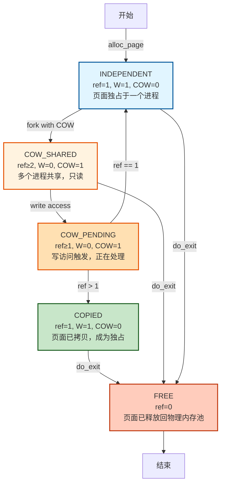
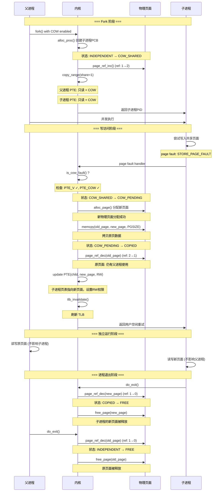
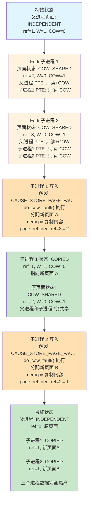

# 练习 1：加载应用程序并执行（需要编码）

## 一、实验目的

本实验要求补全 `load_icode` 中的**第 (6) 步**，即在加载用户程序` ELF `后，正确建立用户态进程的运行现场`（trapframe）`，包括设置：

- 用户栈指针 `sp`
- 程序入口地址 `epc`
- sstatus 寄存器，使其从内核态安全返回到用户态

确保进程第一次被调度执行时，能够从用户程序的第一条指令开始运行。

------

## 二、设计与实现过程说明

在 `load_icode` 的最后阶段，本次实验需要正确填充` trapframe`。在代码中补全的位置如下：

```c
tf->gpr.sp = USTACKTOP;
tf->epc = elf->e_entry;
tf->status = (sstatus & ~SSTATUS_SPP) | SSTATUS_SPIE;
```

下面逐项解释本次实现的设计依据与功能。

------

## **1. 设置用户栈指针（tf->gpr.sp）**

用户态程序运行时必须拥有一个合法的用户栈，本实验在内核中已经创建了用户栈区域：

```c
mm_map(mm, USTACKTOP - USTACKSIZE, USTACKSIZE, VM_READ | VM_WRITE | VM_STACK)
```

因此，只需让 trapframe 的 `sp` 指向用户栈顶：

```c
tf->gpr.sp = USTACKTOP;
```

设计原因：

- RISC-V 用户程序使用正常向下生长的栈，因此设置栈顶即可。
- 返回用户态时，硬件会使用该 sp 继续执行用户程序。

------

## **2. 设置程序入口地址（tf->epc）**

ELF 文件头中的 `e_entry` 字段即程序的第一条指令的虚拟地址：

```c
tf->epc = elf->e_entry;
```

设计原因：

- 当内核执行 `sret` 返回到用户态时，会从 epc 指定的位置开始运行。
- 若不设置或设置错误，用户程序无法启动。

------

## **3. 设置 sstatus（tf->status）**

我们的代码实现：

```c
tf->status = (sstatus & ~SSTATUS_SPP) | SSTATUS_SPIE;
```

含义解释如下：

### (1) 清除 SPP 位（Supervisor Previous Privilege）

```c
~SSTATUS_SPP
```

- `SPP=0` 表示当执行 `sret` 时返回 **用户态 U-mode**
- 若 `SPP=1` 则错误地返回 supervisor 内核态，导致不安全或崩溃。

### (2) 设置 `SPIE `位（Enable User Mode Interrupt）

```c
| SSTATUS_SPIE
```

- `SPIE=1` 表示用户态代码执行时允许中断。
- 这符合 `ucore` 用户进程的执行环境要求。

### (3) 保留其他 sstatus 位

我们的设计中：

```c
tf->status = (sstatus & ~SSTATUS_SPP) | SSTATUS_SPIE;
```

是正确的做法——即保留当前内核中的 `sstatus` 重要位，并仅修改用户态必须调整的部分。

------

## 三、实现流程总结

补全后的 `load_icode()` 做了三件关键任务：

1. **创建新的 mm 并构建页表**
2. **把 ELF 文件的代码段、数据段、BSS 等加载到用户态地址空间**
3. **构建 trapframe，使进程第一次运行能进入用户态从程序入口开始执行**

我们补写的 `trapframe `设置保证：

- 用户态栈已经准备完毕
- 程序入口地址正确写入
- `CPU `执行 `sret` 后会从 `U-mode `开始执行用户程序

至此，用户态进程具备了正确启动的所有必要条件。

------

## 四、从 RUNNING 状态到执行用户程序第一条指令的全过程

下面描述一次完整的过程，从进程被调度到真正执行 ELF 文件的第一条指令。

------

### **1. 进程被调度为 RUNNING**

调度器选择该进程：

```c
proc_run(p)
```

执行关键操作：

1. 切换页表：

   ```c
   lsatp(p->pgdir);
   ```

2. 切换 context（寄存器环境）：

   ```c
   switch_to(&prev->context, &p->context);
   ```

此时 CPU 已经进入该进程的内核栈，准备恢复其 trapframe。

------

### **2. 进入 forkret → forkrets → __trapret 流程**

`copy_thread()` 设置了：

```c
proc->context.ra = (uintptr_t)forkret;
proc->context.sp = (uintptr_t)proc->tf;
```

因此首次调度恢复该进程时：

- switch_to 会跳到 forkret()
- forkret 调用 forkrets(tf)
- forkrets 最终执行一个内联汇编，把 trapframe 加载到硬件寄存器

------

### **3. `sret` 从内核态返回到用户态**

关键动作：

- 设置 pc = tf->epc（即 ELF 的入口地址）
- 设置 sp = tf->gpr.sp（用户栈顶）
- 调整 sstatus，进入用户模式 U-mode

------

### **4. CPU 执行用户程序的第一条指令**

执行地址：

```
elf->e_entry
```

这就是用户程序的真正开始。

到此，用户态程序从 ELF 入口处正常启动运行。

## 五、总结

本实验在 `load_icode` 中补全了 `trapframe `的关键设置，使用户态程序具备正确启动的运行环境。通过设置用户栈、程序入口和 `sstatus，uCore `能够安全地从内核态切换到用户态，使得` ELF` 程序从第一条指令开始执行。

同时，本实验也帮助理解了：

- 用户态与内核态的切换机制
- `trapframe `保存与恢复的作用
- 进程第一次运行必须经过 `forkret → forkrets → sret` 的完整链路

# 练习二：父进程复制自己的内存空间给子进程（需要编码）

## 一、实验目的

本练习要求在 `do_fork` 创建子进程时，将父进程的用户态地址空间复制给子进程，使子进程获得一份独立但内容相同的内存空间。`uCore `中这一过程通过 `copy_mm → dup_mmap → copy_range` 完成，其中 `copy_range` 位于 `kern/mm/pmm.c`，需要我们补全按页复制的核心逻辑。

进一步地，实验还要求思考如何在此基础上设计` Copy-on-Write（COW）`机制，以减少 `fork `时的内存拷贝开销。

------

## 二、copy_range 实现过程说明

### 1. 整体思路

`copy_range` 的职责可以概括为一句话：

> 在虚拟地址区间 `[start, end)` 上，遍历父进程页表，如果某个虚拟页有效，则为子进程分配一个新的物理页，将父页内容拷贝过去，然后在子进程页表中建立相同权限的映射。

在我们的实现中，`share` 参数暂不使用（始终做“深拷贝”），即每个可访问的用户页都会在子进程中分配新的物理页，从而避免父子进程互相影响。

### 2. 关键实现步骤

补全部分核心代码如下（逻辑概括）：

```c
// 1. 找到父进程的页表项 ptep，并确认有效
pte_t *ptep = get_pte(from, start, 0);
...
if (*ptep & PTE_V) {
    // 2. 为子进程获取/创建对应的页表项 nptep
    nptep = get_pte(to, start, 1);

    // 3. 取出权限位 perm
    uint32_t perm = (*ptep & PTE_USER);

    // 4. 找到父进程物理页 page，并给子进程分配新页 npage
    struct Page *page = pte2page(*ptep);
    struct Page *npage = alloc_page();

    // 5. 通过 page2kva 将 Page 转换为内核虚拟地址，执行 memcpy
    void *src_kvaddr = page2kva(page);
    void *dst_kvaddr = page2kva(npage);
    memcpy(dst_kvaddr, src_kvaddr, PGSIZE);

    // 6. 调用 page_insert 将子进程的虚拟地址 start 映射到 npage
    ret = page_insert(to, npage, start, perm);
    if (ret != 0) {
        free_page(npage);
        return ret;
    }
}
```


可以分成下面几个关键点：

1. **遍历虚拟地址区间**
    每次以 `PGSIZE` 为步长遍历 `[start, end)`，并使用 `get_pte(from, start, 0)` 获取父进程当前虚拟页的` PTE`。
2. **跳过不存在的页**
    若 `ptep == NULL` 或该 `PTE `无效，则跳过整个大页/页表或当前页，继续下一个虚拟地址。
3. **复制页面内容**
    借助 `page2kva` 将 `Page` 对象映射到内核虚拟地址空间，使用 `memcpy` 将一整页`（4KB）`从父页复制到新分配的子页中。
4. **建立子进程的页表映射**
    使用 `page_insert(to, npage, start, perm)` 在子进程页表中建立 `start → npage` 的映射，并沿用父进程的用户权限位 (`PTE_USER` 所包含的 `PTE_U/PTE_R/PTE_W` 等)。如果 `page_insert` 失败，则释放 `npage` 并返回错误码，避免内存泄漏。

#### 3. 与整体 fork 流程的关系

在 `do_fork` 中，父进程为子进程复制内存空间的完整调用链为：

```c
do_fork
  └─ copy_mm
       ├─ mm_create / setup_pgdir    // 为子进程分配新的 mm 和页表
       └─ dup_mmap                   // 复制 VMA 结构
            └─ copy_range            // 按页复制实际数据
```


因此，`copy_range` 的正确性直接决定了子进程用户地址空间的正确性。我们的实现保证了：

- 父子进程的各个用户页内容一致；
- 但物理页是相互独立的，不会因为一方写入影响另一方。

------

## 三、Copy-on-Write 机制的实现

在当前实现中，`copy_range` 通过 `share` 参数支持两种模式：

1. **share = 0**：传统深拷贝模式，fork 时立即复制所有用户页
2. **share = 1**：COW 模式，fork 时共享页面，写时复制

### 3.1 COW 模式的启用

在 `dup_mmap()` 中，通过调用 `copy_range(to->pgdir, from->pgdir, vma->vm_start, vma->vm_end, share=1)` 启用 COW 机制。

**COW 的核心思想**：
- Fork 阶段**不真正复制物理页**，而是让父子进程共享同一物理页
- 只在页表层面做标记与权限调整
- 一旦发生写操作就会触发缺页异常，此时才进行真正的复制

### 3.2 COW 的关键标记与数据结构

**PTE 中的 COW 标记位**：
```c
#define PTE_COW 0x100  // 第 8 位作为 COW 标记
```

**Page 结构体中的引用计数**：
```c
struct Page {
    int ref;  // 页面被引用的次数
    // ...
};
```

**关键 API**：
- `page_ref_inc(page)` - 增加页面引用计数
- `page_ref_dec(page)` - 减少页面引用计数
- `page_ref(page)` - 获取页面引用计数值
- `set_page_ref(page, n)` - 设置页面引用计数为 n

### 3.3 Fork 阶段的 COW 建立

在 `copy_range()` 中，当 `share = 1` 时：

1. 遍历父进程的所有虚拟页
2. 对每个有效的页面：
   - 清除写权限：`perm & ~PTE_W`
   - 添加 COW 标记：`| PTE_COW`
   - 父子进程的 PTE 都指向同一个物理页
   - 增加页面引用计数：`page_ref_inc(page)`

这样，父子进程起初都只能"读共享页"，一旦发生写操作就会触发 COW 逻辑。

### 3.4 COW 缺页异常检测

当进程对一个 COW 页执行写操作时，硬件会产生"存储页故障"（CAUSE_STORE_PAGE_FAULT）。

在 `trap.c` 中的异常处理器会：
1. 检查异常是否为 `CAUSE_STORE_PAGE_FAULT`
2. 通过 `get_pte()` 取出对应 PTE
3. 检查是否设置了 `PTE_COW` 位
4. 若是 COW 页面，调用 `do_cow_fault()` 处理

### 3.5 COW 缺页处理流程

`do_cow_fault()` 是 COW 的核心函数，负责在写入时真正执行"写时复制"：

**处理步骤**：

1. **获取原始页面和权限**
   - 从 PTE 获取原物理页面
   - 恢复权限：移除 COW 标志，添加写权限

2. **检查引用计数**
   - 若 `page_ref(old_page) == 1`：只有当前进程使用
     - 直接恢复写权限，无需复制
     - 更新 PTE，刷新 TLB，返回
   - 若 `page_ref(old_page) > 1`：多个进程共享

3. **分配新页面并复制**
   - 分配新物理页面：`alloc_page()`
   - 复制原页面内容：`memcpy(dst, src, PGSIZE)`

4. **更新引用计数和页表**
   - 原页面引用计数减 1：`page_ref_dec(old_page)`
   - 若原页面引用计数为 0，释放该页面：`free_page(old_page)`
   - 新页面引用计数设为 1：`set_page_ref(new_page, 1)`
   - 更新 PTE 指向新页面，设置为可读写

5. **刷新 TLB**
   - `tlb_invalidate(mm->pgdir, addr)`
   - 使 CPU 缓存失效，确保内存一致性

处理完成后，该虚拟页在当前进程中已经变成一个"独占可写页"，而其他进程仍然共享原来的物理页。

### 3.6 进程退出时的资源清理

进程退出时，需要正确递减引用计数、释放物理内存。在 `exit_mmap()` 中：

- 遍历该进程的所有 VMA 和虚拟页
- 对每个有效 PTE：
  - 若带 `PTE_COW`，执行 `page_ref_dec(page)`，如果引用计数到 0 则 `free_page(page)`
  - 若不是 COW 页，则按普通独占页直接 `free_page(page)`

这样可以保证：
- 不会因为 COW 共享而产生内存泄漏
- 也不会错误释放仍被其他进程使用的共享页

------

## 四、小结

- 在本次实验中，我们通过实现 `copy_range` 完成了 **父进程到子进程的用户地址空间复制**，支持两种模式：
  - 传统深拷贝模式（share=0）
  - Copy-on-Write 模式（share=1）

- 在 COW 模式下，uCore 实现了：
  - PTE 层面的 `PTE_COW` 标记
  - Fork 阶段的页面共享与引用计数管理
  - 写缺页时的 `do_cow_fault()` 处理
  - 进程退出时的资源清理

- 这样一来，uCore 可以大幅降低 fork 的内存与时间开销，同时保持语义兼容，提高系统性能。

# 练习三：阅读分析源代码，理解进程执行 fork/exec/wait/exit 的实现，以及系统调用的实现（不需要编码）

## 1. **概述**

uCore 中的进程管理机制模仿 Linux 的简化模型，实现了进程创建、地址空间复制、程序加载、退出与等待等核心功能。其实现主要分布在 `proc.c`、`mm.c`、`pmm.c` 等文件中。
 系统调用 `fork/exec/wait/exit` 属于用户态可调用接口，但其核心逻辑完全在内核态完成，通过 **陷入（trap/ebreak）进入内核、修改 PCB、切换内核栈、页表、调度** 等机制实现。

以下将详细分析四个系统调用的执行流程，并回答题目要求的三个关键问题：

1. 哪些操作在用户态完成？
2. 哪些操作在内核态完成？
3. 用户态与内核态如何交错运行？
4. 内核态结果如何返回用户态？

## 2. **fork 执行流程分析**

### 2.1 用户态部分

用户程序调用 `fork()` → 编译器生成 `ecall/ebreak` → 触发异常进入内核：

```c++
pid = fork();
```

用户态做的事情非常少，只负责发起系统调用。

### 2.2 内核态执行流程（核心逻辑在 `do_fork`）

#### （1）创建 PCB

```c++
proc = alloc_proc();     // 分配并初始化 struct proc_struct
```

设置初始状态为 `PROC_UNINIT`。

#### （2）分配内核栈

```c++
setup_kstack(proc);
```

每个进程都有独立的内核栈。

（3）复制地址空间（或共享）

```c++
copy_mm(clone_flags, proc);
```

若普通 fork，则复制页表与所有 VMA：

```c++
dup_mmap(mm, oldmm);      // 复制映射关系
copy_range(...)           // 复制每个物理页的内容
```

#### （4）复制父进程 trapframe

```c++
copy_thread(proc, stack, tf);
```

并设置子进程返回值 `a0 = 0`（这是 fork 在子进程返回 0 的原因）。


#### （5）加入进程链表，设定父子关系

```c
set_links(proc);
```


#### （6）唤醒子进程

```c
wakeup_proc(proc);
```

子进程进入 `PROC_RUNNABLE`，等待调度。


**最终：返回给父进程子进程的 pid**

```c
return proc->pid;
```

## 3. exec 执行流程分析

`exec` 不创建新进程，而是在当前进程 **替换地址空间并执行新程序**。

### 3.1 用户态

用户程序调用：

```c
execve("/bin/ls", ...)
```

发起系统调用。

### 3.2 内核态执行流程（核心函数 `do_execve → load_icode`）

#### （1）销毁旧地址空间

```c
exit_mmap(mm);
put_pgdir(mm);
mm_destroy(mm);
```


#### （2）新建 mm、页表

```
mm_create();
setup_pgdir(mm);
```


#### （3）加载 ELF 文件到进程内存

核心代码：

```
for each LOAD 段:
    mm_map(...)
    分配物理页 pgdir_alloc_page(...)
    拷贝文件到内存 memcpy(...)
    构造 BSS 段 memset(...)

```


#### （4）分配用户栈


#### （5）设置 trapframe，使进程返回用户态

```c
tf->gpr.sp = USTACKTOP;
tf->epc = elf->e_entry;     // ELF 程序入口
tf->status = 设置为用户态可执行的 sstatus

```


#### （6）调度后恢复时会从新程序入口执行

## 4. wait 执行流程分析

等待子进程结束，并回收资源。

### 内核态流程（`do_wait`）

#### （1）检查目标子进程是否存在并是否已经 ZOMBIE

```c
proc = find_proc(pid);
if (proc->state == PROC_ZOMBIE) goto found;
```

若未退出，则：

#### （2）父进程进入 SLEEPING 状态

```c
current->state = PROC_SLEEPING;
current->wait_state = WT_CHILD;
schedule();   // 让出 CPU
```


#### （3）当子进程 exit 时，会唤醒父进程

```c
wakeup_proc(parent);
```


#### （4）父进程回收子进程资源

```c
unhash_proc(proc);
remove_links(proc);
put_kstack(proc);
kfree(proc);
```


## 5. exit 执行流程分析

进程退出：

### 内核态执行流程（`do_exit`）

#### （1）清理地址空间

```c
exit_mmap(mm);
put_pgdir(mm);
mm_destroy(mm);
```

#### （2）设置为 ZOMBIE 状态

```
current->state = PROC_ZOMBIE;
current->exit_code = error_code;

```

#### （3）重新设置子进程的父亲为 init

保证孤儿进程不会丢失。

#### （4）唤醒父进程

```c
wakeup_proc(parent);
```

#### （5）调度离开，不再返回

```c
schedule();
panic("should not return");
```

## 6. 用户态与内核态的交错执行机制

以下步骤普遍适用于 fork/exec/wait/exit：

### （1）用户态通过 ecall/ebreak 发起系统调用

CSR 保存用户态寄存器 → 切换到内核态。

------

###  （2）内核态执行具体逻辑

如 `do_fork/do_execve/do_wait/do_exit`。

------

###  （3）内核态将结果写入 trapframe（例如返回值放到 a0）

例如：

```c
proc->tf->gpr.a0 = 0;  // 子进程 fork 返回值
```

### （4） 通过 schedule 和 switch_to 切换进程

恢复时再次执行 `sret` 返回到用户态执行下一条指令。

### （5）用户态获得系统调用返回值

例如：

```c
pid = fork();    // 内核已经把返回值写进 a0
```


## 7. 一个用户态进程的生命周期状态图（字符图）

```c
                     +------------------+
                     |   PROC_UNINIT    |
                     |  alloc_proc()    |
                     +---------+--------+
                               |
                               v
                     +------------------+
                     |  PROC_RUNNABLE   |<---------------------------+
                     |  ready to run    |                            |
                     +----+-------+-----+                            |
                          |       |                                  |
            schedule()    |       |  wakeup_proc()                   |
                          v       |                                  |
                     +------------------+                             |
                     |   PROC_SLEEPING  |---- do_wait(), sleep() ----+
                     +------------------+
                               |
                               | child exit / wakeup_proc()
                               v
                     +------------------+
                     |   PROC_RUNNABLE  |
                     +---------+--------+
                               |
                               |
                      schedule() picks process
                               v
                     +------------------+
                     |    RUNNING       |
                     +---------+--------+
                               |
                               | do_exit()
                               v
                     +------------------+
                     |   PROC_ZOMBIE    |
                     | waiting for wait |
                     +---------+--------+
                               |
                               | do_wait 回收资源
                               v
                     +------------------+
                     |   (destroyed)    |
                     +------------------+

```


## 8.要点总结

- **fork**：创建 PCB、复制内存、复制 trapframe → 子进程返回 0，父进程返回 pid

- **exec**：替换地址空间、加载 ELF、重设 trapframe → 原进程"变成"新程序

- **wait**：父进程睡眠直到子进程变成 ZOMBIE → 回收资源

- **exit**：释放内存、转入 ZOMBIE、唤醒父进程

- 所有实际动作均在 **内核态执行**

- 用户态只负责发起系统调用、读取返回值

- 内核通过 trapframe 向用户态返回结果

- 进程状态严格按照 RUNNABLE、RUNNING、SLEEPING、ZOMBIE 流转


# 扩展练习 Challenge1：uCore 中的 Copy-on-Write (COW) 机制实现

## 一、COW 机制概述

Copy-on-Write (COW) 是一种内存优化技术，在 fork 时不立即复制父进程的内存页面，而是让父子进程共享同一物理页面。当任一进程尝试写入共享页面时，才触发缺页异常，此时才进行真正的页面复制。

**核心优势**：
- 减少 fork 时的内存复制开销
- 节省内存空间（多个进程可共享只读页面）
- 提高系统性能（避免不必要的复制）
- 对应用程序完全透明

---

## 二、实现源码讲解

### 2.1 核心数据结构

uCore 中已有的 Page 结构体包含引用计数字段：

```c
// kern/mm/memlayout.h
struct Page {
    int ref;                    // 页面引用计数（已有）
    uint64_t flags;             // 页面状态标志
    unsigned int property;      // 空闲块大小
    list_entry_t page_link;     // 空闲链表
    list_entry_t pra_page_link; // 页面替换算法链表
    uintptr_t pra_vaddr;        // 虚拟地址
};
```

PTE 中的 COW 标记位定义（在 RISC-V 中使用软件保留位）：

```c
// kern/mm/mmu.h
#define PTE_V 0x001    // Valid - 页表项有效
#define PTE_R 0x002    // Read - 可读
#define PTE_W 0x004    // Write - 可写
#define PTE_X 0x008    // Execute - 可执行
#define PTE_U 0x010    // User - 用户态可访问
#define PTE_COW 0x100  // Copy-On-Write - COW标志（软件保留位）
```

**关键点**：
- 使用已有的 `page->ref` 引用计数追踪页面共享情况
- 使用 PTE 中的 COW 标志位标记 COW 页面
- 当 PTE_COW 被设置时，该页面被标记为只读（PTE_W 被清除）

### 2.2 Fork 时启用 COW - dup_mmap() 函数

```c
int dup_mmap(struct mm_struct *to, struct mm_struct *from)
{
    assert(to != NULL && from != NULL);
    list_entry_t *list = &(from->mmap_list), *le = list;
    while ((le = list_prev(le)) != list)
    {
        struct vma_struct *vma, *nvma;
        vma = le2vma(le, list_link);
        nvma = vma_create(vma->vm_start, vma->vm_end, vma->vm_flags);
        if (nvma == NULL)
        {
            return -E_NO_MEM;
        }

        insert_vma_struct(to, nvma);

        // Enable COW (Copy-On-Write) for writable pages
        bool share = 1;  // Enable COW mechanism
        if (copy_range(to->pgdir, from->pgdir, vma->vm_start, vma->vm_end, share) != 0)
        {
            return -E_NO_MEM;
        }
    }
    return 0;
}
```

**关键点**：
- 调用 `copy_range()` 时传入 `share = 1` 启用 COW 机制
- 复制所有 VMA 结构，但页面共享而非复制

### 2.3 页面共享与标记 - copy_range() 函数

```c
int copy_range(pde_t *to, pde_t *from, uintptr_t start, uintptr_t end,
               bool share)
{
    assert(start % PGSIZE == 0 && end % PGSIZE == 0);
    assert(USER_ACCESS(start, end));
    // copy content by page unit.
    do
    {
        // call get_pte to find process A's pte according to the addr start
        pte_t *ptep = get_pte(from, start, 0), *nptep;
        if (ptep == NULL)
        {
            start = ROUNDDOWN(start + PTSIZE, PTSIZE);
            continue;
        }
        // call get_pte to find process B's pte according to the addr start. If
        // pte is NULL, just alloc a PT
        if (*ptep & PTE_V)
        {
            if ((nptep = get_pte(to, start, 1)) == NULL)
            {
                return -E_NO_MEM;
            }
            uint32_t perm = (*ptep & PTE_USER);
            // get page from ptep
            struct Page *page = pte2page(*ptep);
            assert(page != NULL);

            if (share) {
                // COW mechanism: share the physical page instead of copying
                // 1. Set both parent and child page as read-only with COW flag
                // 2. Increase reference count of the shared page

                // Remove write permission and add COW flag
                uint32_t cow_perm = (perm & ~PTE_W) | PTE_COW;

                // Update parent's PTE to be read-only with COW flag
                *ptep = pte_create(page2ppn(page), cow_perm);
                tlb_invalidate(from, start);

                // Set child's PTE to same read-only page with COW flag
                *nptep = pte_create(page2ppn(page), cow_perm);

                // Increase reference count
                page_ref_inc(page);
            } else {
                // Original behavior: allocate new page and copy content
                struct Page *npage = alloc_page();
                assert(npage != NULL);
                int ret = 0;

                void *src_kvaddr = page2kva(page);
                void *dst_kvaddr = page2kva(npage);
                memcpy(dst_kvaddr, src_kvaddr, PGSIZE);
                ret = page_insert(to, npage, start, perm);

                if (ret != 0) {
                    cprintf("copy_range: page_insert failed at 0x%x\n", start);
                    free_page(npage);
                    return ret;
                }
            }
        }
        start += PGSIZE;
    } while (start != 0 && start < end);
    return 0;
}
```

**COW 处理逻辑**（当 `share = 1` 时）：
1. 移除写权限：`perm & ~PTE_W`
2. 添加 COW 标志：`| PTE_COW`
3. 父进程 PTE 更新为只读 + COW
4. 子进程 PTE 指向同一物理页，也是只读 + COW
5. 增加页面引用计数：`page_ref_inc(page)`

### 2.4 写入异常处理 - trap.c

```c
case CAUSE_STORE_PAGE_FAULT:
    // Handle Store/AMO page fault - check for COW
    if (current != NULL && current->mm != NULL) {
        uintptr_t addr = tf->tval;
        struct mm_struct *mm = current->mm;
        struct vma_struct *vma = find_vma(mm, addr);

        if (vma != NULL && (vma->vm_flags & VM_WRITE)) {
            // This is a valid writable region, check for COW
            pte_t *ptep = get_pte(mm->pgdir, addr, 0);
            if (ptep != NULL && (*ptep & PTE_V) && (*ptep & PTE_COW)) {
                // This is a COW page, handle it
                int ret = do_cow_fault(mm, addr, ptep);
                if (ret == 0) {
                    // COW handled successfully, return to continue execution
                    break;
                }
                cprintf("COW fault handling failed at addr=0x%lx, ret=%d\n", addr, ret);
            }
        }
    }
    cprintf("Store/AMO page fault at epc=0x%lx, tval=0x%lx, pid=%d\n",
            tf->epc, tf->tval, current ? current->pid : -1);
    if (current != NULL) {
        do_exit(-E_KILLED);
    }
    break;
```

**异常处理流程**：
1. 检查异常是否为 `CAUSE_STORE_PAGE_FAULT`（写入缺页）
2. 获取故障地址 `addr = tf->tval`
3. 查找该地址所在的 VMA，确认是可写区域
4. 获取对应的 PTE，检查是否有 `PTE_COW` 标志
5. 若是 COW 页面，调用 `do_cow_fault()` 处理
6. 处理成功则返回继续执行，失败则杀死进程

### 2.5 COW 缺页处理 - do_cow_fault() 函数

```c
int do_cow_fault(struct mm_struct *mm, uintptr_t addr, pte_t *ptep)
{
    // Get the original page
    struct Page *old_page = pte2page(*ptep);

    // Get original permissions (without COW flag, with write permission restored)
    uint32_t perm = (*ptep & PTE_USER);
    perm = (perm & ~PTE_COW) | PTE_W;  // Remove COW flag, add write permission

    // Check if this page is only referenced by current process
    if (page_ref(old_page) == 1) {
        // Only one reference, just update permissions directly
        *ptep = pte_create(page2ppn(old_page), perm);
        tlb_invalidate(mm->pgdir, addr);
        return 0;
    }

    // Multiple references, need to copy the page
    struct Page *new_page = alloc_page();
    if (new_page == NULL) {
        return -E_NO_MEM;
    }

    // Copy content from old page to new page
    void *src = page2kva(old_page);
    void *dst = page2kva(new_page);
    memcpy(dst, src, PGSIZE);

    // Update PTE to point to new page with write permission
    // First decrease ref of old page
    page_ref_dec(old_page);
    if (page_ref(old_page) == 0) {
        free_page(old_page);
    }

    // Set new page's ref and update PTE
    set_page_ref(new_page, 1);
    *ptep = pte_create(page2ppn(new_page), perm);
    tlb_invalidate(mm->pgdir, addr);

    return 0;
}
```

**COW 故障处理逻辑**：

1. **获取原始页面和权限**
   - 从 PTE 获取原物理页面
   - 恢复权限：移除 COW 标志，添加写权限

2. **检查引用计数**
   - 若 `page_ref(old_page) == 1`：只有当前进程使用
     - 直接恢复写权限，无需复制
     - 更新 PTE，刷新 TLB，返回
   - 若 `page_ref(old_page) > 1`：多个进程共享

3. **分配新页面并复制**
   - 分配新物理页面
   - 复制原页面内容到新页面

4. **更新引用计数和页表**
   - 原页面引用计数减 1
   - 若原页面引用计数为 0，释放该页面
   - 新页面引用计数设为 1
   - 更新 PTE 指向新页面，设置为可读写

5. **刷新 TLB**
   - 使 CPU 缓存失效，确保内存一致性

---

## 三、COW 执行流程

COW 的执行流程分为两个阶段：Fork 阶段和写入阶段。在 Fork 阶段，`do_fork()` 调用 `copy_mm()` 复制内存管理结构，其中 `dup_mmap()` 调用 `copy_range(share=1)` 启用 COW 机制。此时父子进程共享物理页面，但都被标记为只读（PTE_W 被清除，PTE_COW 被设置），引用计数增加。在写入阶段，当子进程尝试写入共享页面时，CPU 触发 `CAUSE_STORE_PAGE_FAULT` 异常。异常处理器检查 PTE_COW 标志，确认这是 COW 页面后调用 `do_cow_fault()` 处理。`do_cow_fault()` 根据引用计数决定是否复制：若引用计数为 1，直接恢复写权限；若大于 1，分配新页面、复制内容、更新 PTE。最后刷新 TLB 并返回用户空间重试写操作。

### 3.2 页面状态转换（有限状态自动机）

#### 3.2.1 状态转换图



#### 3.2.2 各状态说明

页面在 COW 机制中经历五个状态：INDEPENDENT（独占）、COW_SHARED（共享）、COW_PENDING（处理中）、COPIED（已拷贝）和 FREE（已释放）。INDEPENDENT 状态表示页面只被一个进程使用，可读写。COW_SHARED 状态表示多个进程共享该页面，都被标记为只读。COW_PENDING 状态是写访问触发异常后的处理阶段。COPIED 状态表示页面已被拷贝给当前进程，成为独占页面。FREE 状态表示页面已释放回物理内存池。

#### 3.2.4 进程交互序列图




#### 3.2.6 多进程 COW 场景流程图

**场景：父进程 fork 出两个子进程，都修改数据**



### 3.3 数据结构之间的关系

```
进程 (proc_struct)
  ├─ mm (mm_struct) - 内存管理
  │   ├─ pgdir - 页目录表
  │   ├─ mmap_list - VMA 链表
  │   └─ mm_count - 引用计数
  │
  └─ 虚拟内存区域 (vma_struct)
      ├─ vm_start, vm_end - 地址范围
      ├─ vm_flags - 权限标志
      └─ 对应的物理页面 (Page)
          ├─ ref - 引用计数
          ├─ flags - 页面状态
          └─ 页表项 (PTE)
              ├─ PTE_V - 有效位
              ├─ PTE_W - 写权限
              ├─ PTE_COW - COW 标志
              └─ PPN - 物理页号
```

---

## 四、COW 测试

COW 机制的编译和测试使用以下三个命令：

```bash
$ make clean
$ make build-cowtest
$ make qemu
```

---

### 4.1 测试用例

COW 实现包含以下测试场景：

#### 测试 1: 基本 COW 隔离
- 父进程创建子进程
- 子进程修改共享页面
- 验证父进程的数据不受影响

#### 测试 2: 多子进程隔离
- 父进程创建多个子进程
- 每个子进程独立修改数据
- 验证各进程数据隔离

#### 测试 3: 嵌套 fork 隔离
- 父进程 fork 出子进程
- 子进程再 fork 出孙进程
- 验证多层级 fork 的内存隔离

### 4.2 测试输出


---

# 扩展练习 Challenge2：用户程序的加载机制

## 用户程序何时被预先加载到内存中？

uCore 中的用户程序在内核启动时被预先加载到内存中。具体来说，当 `kern_init()` 调用 `proc_init()` 创建 init 进程时，会通过 `init_main()` 调用 `kernel_execve()` 执行用户程序。最终在 `load_icode()` 函数（位于 `kern/process/proc.c`）中，一次性将整个 ELF 文件加载到物理内存。这个过程包括分配物理页面、拷贝 TEXT/DATA/BSS 段、建立页表映射和设置 trapframe。

## 与常用操作系统的加载方式有何区别？

uCore 采用提前加载（Eager Loading）方式，在内核启动时就将整个程序加载到内存中，这与 Linux 的按需加载（Lazy Loading）方式完全不同。Linux 在程序运行时才动态加载页面，每当访问未加载的页面时会触发 page fault，然后内核才将该页面加载到内存。这导致 uCore 的内存占用较高但启动流畅，而 Linux 的内存占用较低但会频繁发生 page fault。

## 原因是什么？

uCore 采用提前加载主要是出于教学目的。首先，这种方式大大简化了实现，避免了复杂的动态链接机制，使学生能够专注于内存管理和进程管理的核心概念。其次，uCore 运行在 QEMU 模拟器上，I/O 延迟较大，一次性加载整个程序比多次 page fault 更高效。第三，uCore 的模拟环境内存有限（通常只有几十 MB），一次性分配内存更容易控制和调试。最后，提前加载避免了运行时的不确定性因素，使程序行为更加可预测。

相比之下，Linux 采用按需加载是因为它需要支持生产环境的需求，包括大型程序、动态链接库、虚拟内存置换等复杂机制。按需加载能够充分利用有限的物理内存，支持运行时加载和卸载模块，提供更好的灵活性和可扩展性。

# 分支任务：gdb 调试页表查询过程

## 调试目的

本分支任务旨在通过 GDB 调试器深入理解 QEMU 虚拟机在模拟地址翻译时的完整执行流程。具体目标包括：

1. 理解 QEMU 源码中虚拟地址到物理地址的翻译关键路径与分支逻辑
2. 通过实际调试演示虚拟地址如何被翻译成物理地址
3. 深入分析页表翻译中三级循环的作用与两行关键操作（计算 PTE 地址、读取 PTE）
4. 探索 QEMU 中 TLB 查找的源码实现，理解 TLB miss 时的页表查询流程
5. 对比 QEMU 软件模拟的 TLB 与真实 CPU 硬件 TLB 的逻辑区别

---

# Lab2：QEMU 4.1.1 地址转换 / TLB 调试流程与问题回答

> 环境：QEMU 4.1.1（riscv64-softmmu）+ uCore Lab2  
> 目标：通过 **调试 QEMU 源码**观察“TLB 查找 → TLB miss → 页表走查（SV39）→ 填充 TLB”，并对比 **未开启分页（satp=0）** 与 **开启分页（SV39）** 的差异。

---

## 一、三终端分别做什么

- 终端1（运行 QEMU）：`make debug`（Makefile 里带 `-s -S`）
  - `-s`：开启 gdbstub `localhost:1234`
  - `-S`：CPU 上电先暂停
- 终端2（客体 GDB，调 uCore）：`make gdb` → `target remote localhost:1234`
- 终端3（宿主 GDB，调 QEMU）：`sudo gdb <qemu-system-riscv64>` → `attach <PID>`

注意：终端3一旦在断点处停住，QEMU vCPU 线程也停住，终端2会表现为 `Continuing.` 不动；所以终端3看完要及时 `c` 放行。

---

## 二、真实调试流程记录

### 0）启动与连接

终端1（在 `lab2/lab2`）：

```sh
make debug
```

终端2：

```gdb
make gdb
set remotetimeout unlimited
```

终端3（先找 PID，再 attach）：

```sh
pgrep -f qemu-system-riscv64
sudo gdb 
```

```gdb
attach <PID>
handle SIGPIPE nostop noprint
c
```

---

### 1）任务1

调用链：

1. target/riscv/cpu_helper.c:riscv_cpu_tlb_fill(...)
2. target/riscv/cpu_helper.c:get_physical_address(...)（页表翻译核心）
3. include/exec/memory_ldst_phys.inc.h:ldq_phys() / ldl_phys()（读 PTE）
4. 返回后 accel/tcg/cputlb.c:tlb_set_page() → tlb_set_page_with_attrs()（写入软件 TLB）

#### 1.1 在客体侧选择一个“必然触发访存”的位置（kern_init 的 memset）

终端2：

```gdb
b kern_init
c
```

然后我们使用`x/8i $pc`来查看接下来的一些指令：

```
(gdb) x/8i $pc
=> 0xffffffffc020004a <kern_init>:      auipc   a0,0xb3   
   0xffffffffc020004e <kern_init+4>:
   0xffffffffc020004e <kern_init+4>:
    addi        a0,a0,670
   0xffffffffc0200052 <kern_init+8>:    auipc   a2,0xb7
   0xffffffffc0200056 <kern_init+12>:        
    addi        a2,a2,1858
   0xffffffffc020005a <kern_init+16>:        
    addi        sp,sp,-16
   0xffffffffc020005c <kern_init+18>:   sub     a2,a2,a0
   0xffffffffc020005e <kern_init+20>:   li      a1,0
   0xffffffffc0200060 <kern_init+22>:   sd      ra,8(sp)
```

我们si单步执行到访存指令sd之前，然后回到终端3打下断点并放行

```
b get_physical_address if addr==0xffffffffc0209ff8
c
```

然后在终端2继续单步执行si，这样我们运行到了sd命令中，终端3就会命中断点：

```
Thread 1 "qemu-system-ris" hit Breakpoint 1, get_physical_address (env=0x614a1bc08cf0, physical=0x7ffcfc595bc8, prot=0x7ffcfc595bc0, addr=18446744072637907018, access_type=0, mmu_idx=1) at /mnt/c/Users/13081/qemu-4.1.1/target/riscv/cpu_helper.c:158
158     {
```

然后我们在终端3查看其正要被翻译的虚拟地址addr

```
p/x addr
```

输出如下：

```
(gdb) p/x addr
$2 = 0xffffffffc0209ff8
```

然后在终端3中运行到写物理地址（写physical）的地方

```
watch *(unsigned long long*)physical
c
```

到达这里之后查看虚拟地址和对应的物理地址

```
p/x addr
p/x *physical
```

得到输出结果

```
(gdb) p/x addr
$2 = 0xffffffffc0209ff8
(gdb) p/x *physical
$3 = 0x80209000
```

这就是`0xffffffffc0209ff8`这个虚拟地址被翻译成了物理地址`0x80209000`

然后多continue几次，让终端2中的si指令被放行，然后回到终端2，查看sp的值

```
i r sp
```

输出如下：

```
(gdb) i r sp
sp             0xffffffffc0209ff0       0xfff
```

显然，这里访存的地址+8（偏移量），就是终端3中的地址，也就是我们刚才看的那个地址。

### 2）任务2：单步调试页表翻译的部分，解释一下关键的操作流程。

同样，先：

终端1：

```sh
make debug
```

终端2：

```gdb
make gdb
set remotetimeout unlimited
```

终端3（先找 PID，再 attach）：

```sh
pgrep -f qemu-system-riscv64
sudo gdb 
```

```gdb
attach <PID>
handle SIGPIPE nostop noprint
c
```

以上一系列做完之后，终端2中

```
(gdb) b kern_init
(gdb) c
(gdb) p/x (unsigned long long)edata
(gdb) p/x (unsigned long long)end
(gdb) p/x ((unsigned long long)edata & ~0xfffull)   # edata_page
```

目的是找到一个.bss清零区域的页基址，后续用它做条件断点，保证抓到第一次写这页时的地址翻译。

然后终端3：

```
b riscv_cpu_tlb_fill if access_type!=MMU_INST_FETCH && (((unsigned long long)address & ~0xfffull)==0xffffffffc02b3000)
c
```

然后终端2也continue一下放行

```
c
```

命中之后，看一下addr的值,这就是正在翻译的值。

```
p/x address
```

得到结果：

```
$1 = 0xffffffffc02b32e8
```

然后进入get_physical_address

```
tbreak get_physical_address
c
```

然后确认一下根页表

```
p/x env->satp
```

结果如下：

```
$2 = 0x800000000008020a
```

然后确认下分页模式

```
p/x (env->satp >> 60)                          # mode：8=SV39
```

结果为`$3 = 0x8`，说明是SV39.

然后看下根页表物理地址

```
p/x (env->satp & ((1ULL<<44)-1))               # PPN
p/x ((env->satp & ((1ULL<<44)-1)) << 12)       # root_pt_pa
```

结果如下：

```
(gdb) p/x (env->satp & ((1ULL<<44)-1))
$4 = 0x8020a
(gdb) p/x ((env->satp & ((1ULL<<44)-1)) << 12) 
$5 = 0x8020a000
```

最后再看下正在翻译的地址

```
p/x addr
```

和上面看到的那个地址相同：

```
$6 = 0xffffffffc02b32e8
```

然后我们看读pte的瞬间：先断到ldq_phys函数

```
tbreak ldq_phys
c
```

然后出来拿到pte物理地址

```
up
p/x pte_addr
```

结果如下：

```
(gdb) p/x pte_addr
$7 = 0x8020aff8
```

然后跑完

```
down
finish
```

finish 返回后 gdb 会提示：Value returned is $N = <pte值>，这个 $N 就是本层 PTE 内容。结果如下：

```
(gdb) finish
Run till exit from #0  ldq_phys (as=0x55572dd79770,
    addr=2149625848)
    at /mnt/c/Users/13081/qemu-4.1.1/include/exec/memory_ldst_phys.inc.h:32
0x00005556ef071a69 in get_physical_address (env=0x55572dd6bcf0, physical=0x7bfc39ffde30, prot=0x7bfc39ffde24, addr=18446744072638640872, access_type=1, mmu_idx=1) at /mnt/c/Users/13081/qemu-4.1.1/target/riscv/cpu_helper.c:252
252             target_ulong pte = ldq_phys(cs->as, pte_addr);
Value returned is $8 = 536871119
```

然后我们解码pte

```
p/x $N  
p/x ($N & 1)       # V
p/x ($N & 0xe)     # R/W/X：0=指针节点；非0=叶子节点
```

```
(gdb) p/x $8
$9 = 0x200000cf
(gdb) p/x ($8 & 1)
$10 = 0x1
(gdb) p/x ($8 & 0xe)
$11 = 0xe
```

然后验证pa写入了`*physical`

```
watch *(unsigned long long*)physical
c
p/x addr
p/x *physical
```

结果如下：

```
(gdb) p/x addr
$12 = 0xffffffffc02b32e8
(gdb) p/x *physical
$13 = 0x802b3000
```

可以看到，`0xffffffffc02b32e8`这个虚拟地址被翻译成了 物理地址`0x802b3000`。我们本题的调试就这样结束了。

### 2）任务3：是否能够在qemu-4.1.1的源码中找到模拟cpu查找tlb的C代码，通过调试说明其中的细节

源码：

```
在 qemu-4.1.1/accel/tcg/cputlb.c：

TLB lookup（快路径）：load_helper() / store_helper()
里面会取 CPUTLBEntry *entry = tlb_entry(env, mmu_idx, addr);
关键判断是 tlb_hit(...)（以及可能的 victim_tlb_hit(...)）
命中则直接返回（不会进入 tlb_fill）
TLB miss 入口：tlb_fill()（只有 miss 才会来）
填 TLB：tlb_set_page() / tlb_set_page_with_attrs()
在 qemu-4.1.1/target/riscv/...：

riscv_cpu_tlb_fill()：RISC-V 的 miss 回调
get_physical_address()：页表 walk（刚才已经单步做过了）
```

过程

同样，先：

终端1（：

```sh
make debug
```

终端2：

```gdb
make gdb
set remotetimeout unlimited
```

终端3（先找 PID，再 attach）：

```sh
pgrep -f qemu-system-riscv64
sudo gdb 
```

```gdb
attach <PID>
handle SIGPIPE nostop noprint
c
```

以上一系列做完之后，终端2中

```
(gdb) b kern_init
(gdb) c
(gdb) p/x (unsigned long long)edata
(gdb) p/x (unsigned long long)end
(gdb) p/x ((unsigned long long)edata & ~0xfffull)   # edata_page
```

目的是找到一个.bss清零区域的页基址，后续用它做条件断点，保证抓到第一次写这页时的地址翻译。

然后终端3：

```
b riscv_cpu_tlb_fill if access_type!=MMU_INST_FETCH && (((unsigned long long)address & ~0xfffull)==0xffffffffc02b3000)
c
```

然后终端2也continue一下放行

```
c
```

命中之后，记录

```
p/x address
bt
```

得到结果

```
(gdb) p/x address
$2 = 0xffffffffc02b32e8
(gdb) bt
#0  riscv_cpu_tlb_fill
    (cs=0x5d00820462d0, address=18446744072638640872, size=1, access_type=MMU_DATA_STORE, mmu_idx=1, probe=false, retaddr=129454173062231)   
    at /mnt/c/Users/13081/qemu-4.1.1/target/riscv/cpu_helper.c:438
#1  0x00005d0056bfa68f in tlb_fill
    (cpu=0x5d00820462d0, addr=18446744072638640872, size=1, access_type=MMU_DATA_STORE, mmu_idx=1, retaddr=129454173062231)
    at /mnt/c/Users/13081/qemu-4.1.1/accel/tcg/cputlb.c:878
#2  0x00005d0056bfe7f4 in store_helper
    (big_endian=false, size=1, retaddr=129454173062231, oi=1, val=0, addr=18446744072638640872, env=0x5d008204ece0)
    at /mnt/c/Users/13081/qemu-4.1.1/accel/tcg/cputlb.c:1522
#3  helper_ret_stb_mmu
    (env=0x5d008204ece0, addr=18446744072638640872, val=0 '\000', oi=1, retaddr=129454173062231)
    at /mnt/c/Users/13081/qemu-4.1.1/accel/tcg/cputlb.c:1642
#4  0x000075bce6000457 in code_gen_buffer ()   
#5  0x00005d0056c1f2bb in cpu_tb_exec
    (cpu=0x5d00820462d0, itb=0x75bce6000340 <code_gen_buffer+787>)
    at /mnt/c/Users/13081/qemu-4.1.1/accel/tcg/cpu-exec.c:173
#6  0x00005d0056c20101 in cpu_loop_exec_tb     
    (cpu=0x5d00820462d0, tb=0x75bce6000340 <code_gen_buffer+787>, last_tb=0x75bced2b7518, tb_exit=0x75bced2b7510)
    at /mnt/c/Users/13081/qemu-4.1.1/accel/tcg/cpu-exec.c:621
#7  0x00005d0056c20436 in cpu_exec
    (cpu=0x5d00820462d0)
    at /mnt/c/Users/13081/qemu-4.1.1/accel/tcg/cpu-exec.c:732
--Type <RET> for more, q to quit, c to continue without paging--
#8  0x00005d0056bd2a96 in tcg_cpu_exec
    (cpu=0x5d00820462d0)
    at /mnt/c/Users/13081/qemu-4.1.1/cpus.c:1435
#9  0x00005d0056bd334f in qemu_tcg_cpu_thread_fn (arg=0x5d00820462d0)
    at /mnt/c/Users/13081/qemu-4.1.1/cpus.c:1743
#10 0x00005d005707f560 in qemu_thread_start    
    (args=0x5d008205c970)
    at util/qemu-thread-posix.c:502
#11 0x000075bcef694ac3 in start_thread
    (arg=<optimized out>)
    at ./nptl/pthread_create.c:442
#12 0x000075bcef7268c0 in clone3 ()
    at ../sysdeps/unix/sysv/linux/x86_64/clone3.S:81
```

然后继续

```
tbreak tlb_set_page
c
p/x vaddr
p/x paddr
p prot
```

得到结果

```
(gdb) p/x vaddr
$3 = 0xffffffffc02b3000
(gdb) p/x paddr
$4 = 0x802b3000
(gdb) p prot
$5 = 7
```

然后再继续

```
b riscv_cpu_tlb_fill if access_type!=MMU_INST_FETCH && (((unsigned long long)address & ~0xfffull)==0xffffffffc02b3000)
c
```

发现又命中了

```
(gdb) b riscv_cpu_tlb_fill if access_type!=MMU_INST_FETCH && (((unsigned long long)address & ~0xfffull)==0xffffffffc02b3000)
Note: breakpoint 1 also set at pc 0x5d0056cb5171.
Breakpoint 3 at 0x5d0056cb5171: file /mnt/c/Users/13081/qemu-4.1.1/target/riscv/cpu_helper.c, line 438.
(gdb) c
Continuing.

Thread 3 "qemu-system-ris" hit Breakpoint 1, riscv_cpu_tlb_fill (cs=0x5d00820462d0, address=18446744072638641912, size=4, access_type=MMU_DATA_LOAD, mmu_idx=1, probe=false, retaddr=129454173153070) at /mnt/c/Users/13081/qemu-4.1.1/target/riscv/cpu_helper.c:438
438     {
```

我们再去tlb_set_page ，发现它在填同一页：

```
tbreak tlb_set_page
c
p/x vaddr
p/x paddr
```

这里输出结果和刚才一样

```
(gdb) p/x vaddr
$6 = 0xffffffffc02b3000
(gdb) p/x paddr
$7 = 0x802b3000
```

### 4）仍然是tlb，qemu中模拟出来的tlb和我们真实cpu中的tlb有什么**逻辑上的区别**

过程

同样，先：

终端1：

```sh
make debug
```

终端2：

```gdb
make gdb
set remotetimeout unlimited
```

终端3（先找 PID，再 attach）：

```sh
pgrep -f qemu-system-riscv64
sudo gdb 
```

```gdb
attach <PID>
handle SIGPIPE nostop noprint
c
```

以上一系列做完之后，终端2中打下断点

```
hbreak *0x80200000
c
```

这里因为分页未开时符号虚拟地址不可靠

然后查看下后面的命令：

```
x/25i $pc
```

得到结果

```
(gdb) x/25i $pc
=> 0x80200000:  auipc   t0,0xb
   0x80200004:  mv      t0,t0
   0x80200008:  sd      a0,0(t0)
   0x8020000c:  auipc   t0,0xb
   0x80200010:  addi    t0,t0,-4
   0x80200014:  sd      a1,0(t0)
   0x80200018:  lui     t0,0xc020a
   0x8020001c:  addiw   t1,zero,-3
   0x80200020:  slli    t1,t1,0x1e
   0x80200022:  sub     t0,t0,t1
   0x80200026:  srli    t0,t0,0xc
   0x8020002a:  addiw   t1,zero,-1
   0x8020002e:  slli    t1,t1,0x3f
   0x80200030:  or      t0,t0,t1
   0x80200034:  csrw    satp,t0
   0x80200038:  sfence.vma
   0x8020003c:  lui     sp,0xc020a
   0x80200040:  lui     t0,0xc0200
   0x80200044:  addi    t0,t0,74
   0x80200048:  jr      t0
   0x8020004a:  auipc   a0,0xb3
   0x8020004e:  addi    a0,a0,670
   0x80200052:  auipc   a2,0xb7
   0x80200056:  addi    a2,a2,1858
   0x8020005a:  addi    sp,sp,-16
```

这里是 entry.S 的指令序列。

然后我们单步两下到`sd      a0,0(t0)`这个位置

接着，到终端3，我们只抓satp为0的一次翻译。

```
tbreak get_physical_address if ((env->satp >> 60) == 0)
```

然后我们去终端2`si`步入那个sd指令

终端3命中后，我们检查satp寄存器的值：

```
(gdb) p/x env->satp 
$1 = 0x0
```

结果是0.

接下来，我们在`ldq_phys`打个断点

```
tbreak ldq_phys
c
```

continue之后，界面一直停在

```
(gdb) c
Continuing.

```

这一块，说明`ldq_phys`没有命中。

然后我们ctrl+c停掉，去终端2单步到csrw指令之前

回到终端3，只抓satp为8的

```
tbreak get_physical_address if ((env->satp >> 60) == 8)
```

回到终端2`si`单步执行

终端3打印satp寄存器

```
(gdb) p/x env->satp 
$3 = 0x800000000008020a
```

然后尝试进入`ldq_phys`

```
tbreak ldq_phys
c
```

这一次命中了

```
(gdb) c
Continuing.

Thread 1 "qemu-system-ris" hit Temporary breakpoint 2, ldq_phys (as=0x635ef11db760, addr=2149621760) at /mnt/c/Users/13081/qemu-4.1.1/include/exec/memory_ldst_phys.inc.h:32
32                                             
    MEMTXATTRS_UNSPECIFIED, NULL);
```

对于以上内容，satp=0 时：get_physical_address 直通（PA=VA），不读 PTE（不命中 ldq_phys）。

satp=SV39 时：get_physical_address 进入页表 walk，会读 PTE（命中 ldq_phys），并通过 tlb_set_page 把结果缓存到 QEMU 的软件 TLB。

# Lab5调试

## 1.ecall

首先需要明确的是ecall指令并没有相关的helper，他是嵌入在异常处理函数之中的。

##### 第一个终端

```
make debug
```

##### 第二个终端

```
pgrep -f qemu-system-riscv64 
sudo gdb
(gdb) attach <刚才查到的PID>
(gdb) handle SIGPIPE nostop noprint
(gdb) continue # 之后就启动执行
```

##### 第三个终端

```
make gdb
add-symbol-file obj/__user_exit.out
break user/libs/syscall.c:18
c
si直到运行到ecall指令
```

然后我们回到第二个终端

```
ctrl+C
b riscv_cpu_do_interrupt//中断
b riscv_raise_exception//异常
```

然后我们回到第三个中断

```
si
```

这时我们可以看到第三个终端的执行被卡住了，因为在qemu界面我们执行到了断点。

```
Continuing.
[Switching to Thread 0x7ba721307640 (LWP 26147)]

Thread 3 "qemu-system-ris" hit Breakpoint 2, riscv_raise_exception (env=0x5795011a5110, exception=8, pc=0) at /mnt/d/Desktop/OS实验/lab5/qemu-4.1.1/target/riscv/op_helper.c:31
31 CPUState *cs = env_cpu(env);
```

我们可以看到这里出发了异常，异常码为8，在系统中就是ecall指令的编号

我们在cpu_bits.h文件里面可以看到

```
/* Exception causes */
#define EXCP_NONE                          -1 /* sentinel value */
#define RISCV_EXCP_INST_ADDR_MIS           0x0
#define RISCV_EXCP_INST_ACCESS_FAULT       0x1
#define RISCV_EXCP_ILLEGAL_INST            0x2
#define RISCV_EXCP_BREAKPOINT              0x3
#define RISCV_EXCP_LOAD_ADDR_MIS           0x4
#define RISCV_EXCP_LOAD_ACCESS_FAULT       0x5
#define RISCV_EXCP_STORE_AMO_ADDR_MIS      0x6
#define RISCV_EXCP_STORE_AMO_ACCESS_FAULT  0x7
#define RISCV_EXCP_U_ECALL                 0x8
#define RISCV_EXCP_S_ECALL                 0x9
#define RISCV_EXCP_H_ECALL                 0xa
#define RISCV_EXCP_M_ECALL                 0xb
#define RISCV_EXCP_INST_PAGE_FAULT         0xc /* since: priv-1.10.0 */
#define RISCV_EXCP_LOAD_PAGE_FAULT         0xd /* since: priv-1.10.0 */
#define RISCV_EXCP_STORE_PAGE_FAULT        0xf /* since: priv-1.10.0 */
```

0x8就是对应的用户态发出的ecall指令。而我们的系统正是在这个时候从用户态发出了指令。

我们来看一下源码：

```c
void QEMU_NORETURN riscv_raise_exception(CPURISCVState *env,
                                          uint32_t exception, uintptr_t pc)
{
    CPUState *cs = env_cpu(env);
    qemu_log_mask(CPU_LOG_INT, "%s: %d\n", __func__, exception);
    cs->exception_index = exception;
    cpu_loop_exit_restore(cs, pc);
}
```

1. 获取当前CPU的状态结构体（CPUState）。

2. 记录异常类型（exception_index），用于后续trap handler判断异常原因。

3. 输出日志，便于调试。

4.调用 cpu_loop_exit_restore，强制QEMU跳出当前指令执行，进入trap/异常处理流程。


然后我们还可以出入其他的指令对寄存器的各种状态进行查看。

```
(gdb) bt
#0  riscv_raise_exception (env=0x605bbb9e2110, exception=8, pc=0)
    at /mnt/d/Desktop/OS实验/lab5/qemu-4.1.1/target/riscv/op_helper.c:31
#1  0x0000605bb05de9e7 in helper_raise_exception (env=0x605bbb9e2110, exception=8)
    at /mnt/d/Desktop/OS实验/lab5/qemu-4.1.1/target/riscv/op_helper.c:39
#2  0x00007aa506000124 in code_gen_buffer ()
#3  0x0000605bb054b2fb in cpu_tb_exec (cpu=0x605bbb9d9700, itb=0x7aa506000040 <code_gen_buffer+19>)
    at /mnt/d/Desktop/OS实验/lab5/qemu-4.1.1/accel/tcg/cpu-exec.c:173
#4  0x0000605bb054c141 in cpu_loop_exec_tb (cpu=0x605bbb9d9700, tb=0x7aa506000040 <code_gen_buffer+19>, 
    last_tb=0x7aa50cb06918, tb_exit=0x7aa50cb06910)
    at /mnt/d/Desktop/OS实验/lab5/qemu-4.1.1/accel/tcg/cpu-exec.c:621
#5  0x0000605bb054c476 in cpu_exec (cpu=0x605bbb9d9700)
    at /mnt/d/Desktop/OS实验/lab5/qemu-4.1.1/accel/tcg/cpu-exec.c:732
#6  0x0000605bb04fead6 in tcg_cpu_exec (cpu=0x605bbb9d9700)
    at /mnt/d/Desktop/OS实验/lab5/qemu-4.1.1/cpus.c:1435
#7  0x0000605bb04ff38f in qemu_tcg_cpu_thread_fn (arg=0x605bbb9d9700)
    at /mnt/d/Desktop/OS实验/lab5/qemu-4.1.1/cpus.c:1743
#8  0x0000605bb0981457 in qemu_thread_start (args=0x605bbb9efde0) at util/qemu-thread-posix.c:502
#9  0x00007aa50d494ac3 in start_thread (arg=<optimized out>) at ./nptl/pthread_create.c:442
#10 0x00007aa50d5268c0 in clone3 () at ../sysdeps/unix/sysv/linux/x86_64/clone3.S:81
(gdb) p exception
$1 = 8
(gdb) p exception
$2 = 8
(gdb) p *env
$3 = {gpr = {0, 8388724, 2147483216, 0, 0, 0, 2147483544, 0, 2147483508, 2147483508, 30, 73, 8391112, 
    2147483544, 0, 0, 0, 0, 8388712, 37, 2147483544, 8390372, 18446744073709551615, 8390912, 0, 0, 8391112, 0,   
    8391112, 0, 0, 0}, fpr = {0 <repeats 32 times>}, pc = 8388868, load_res = 18446744073709551615,
  load_val = 0, frm = 0, badaddr = 0, priv_ver = 69888, misa = 9223372036856090925,
  misa_mask = 9223372036856090925, features = 3, priv = 0, resetvec = 4096, mhartid = 0,
  mstatus = 9223372036855062530, mip = 0, miclaim = 512, mie = 168, mideleg = 546, sptbr = 0,
  satp = 9223372036855301310, sbadaddr = 0, mbadaddr = 0, medeleg = 45321, stvec = 18446744072637910916,
  sepc = 8388640, scause = 3, mtvec = 2147484784, mepc = 18446744072637908388, mcause = 9, mtval = 0,
  scounteren = 18446744073709551615, mcounteren = 18446744073709551615, sscratch = 18446744072640782336,
  mscratch = 2147597824, mfromhost = 0, mtohost = 0, timecmp = 555326, pmp_state = {pmp = {{
        addr_reg = 536887295, cfg_reg = 24 '\030'}, {addr_reg = 18446744073709551615, cfg_reg = 31 '\037'}, {    
        addr_reg = 0, cfg_reg = 0 '\000'} <repeats 14 times>}, addr = {{sa = 2147483648, ea = 2147614719}, {     
        sa = 0, ea = 18446744073709551615}, {sa = 0, ea = 18446744073709551615}, {sa = 0,
        ea = 18446744073709551615}, {sa = 0, ea = 18446744073709551615}, {sa = 0, ea = 18446744073709551615}, {  
        sa = 0, ea = 18446744073709551615}, {sa = 0, ea = 18446744073709551615}, {sa = 0, ea = 0}, {sa = 0,      
        ea = 0}, {sa = 0, ea = 0}, {sa = 0, ea = 0}, {sa = 0, ea = 0}, {sa = 0, ea = 0}, {sa = 0, ea = 0}, {     
        sa = 0, ea = 0}}, num_rules = 2}, debugger = false, fp_status = {float_detect_tininess = 0 '\000',       
    float_rounding_mode = 0 '\000', float_exception_flags = 0 '\000', floatx80_rounding_precision = 0 '\000',    
    flush_to_zero = 0 '\000', flush_inputs_to_zero = 0 '\000', default_nan_mode = 1 '\001',
    snan_bit_is_one = 0 '\000'}, timer = 0x605bbba52920}
(gdb) p pc
$4 = 0
(gdb) info registers
rax            0x605bbb9e2110      105947105992976
rbx            0x0                 0
rcx            0x8                 8
rdx            0x0                 0
rsi            0x8                 8
rdi            0x605bbb9e2110      105947105992976
rbp            0x7aa50cb06370      0x7aa50cb06370
rsp            0x7aa50cb06340      0x7aa50cb06340
r8             0x7aa5000528f0      134849088530672
r9             0x0                 0
r10            0x7aa50001dcc0      134849088314560
r11            0x3                 3
r12            0x7aa50cb07640      134849301083712
r13            0x0                 0
r14            0x7aa50d4947d0      134849311098832
r15            0x7ffe30d4ccf0      140729717673200
rip            0x605bb05de959      0x605bb05de959 <riscv_raise_exception+23>
eflags         0x202               [ IF ]
cs             0x33                51
ss             0x2b                43
ds             0x0                 0
es             0x0                 0
--Type <RET> for more, q to quit, c to continue without paging--
fs             0x0                 0
gs             0x0                 0
```

### 1. 调用栈（bt）

```
#0  riscv_raise_exception (env=0x605bbb9e2110, exception=8, pc=0)
#1  helper_raise_exception (env=0x605bbb9e2110, exception=8)
#2  code_gen_buffer ()
#3  cpu_tb_exec
#4  cpu_loop_exec_tb
#5  cpu_exec
#6  tcg_cpu_exec
#7  qemu_tcg_cpu_thread_fn
#8  qemu_thread_start
#9  start_thread
#10 clone3
```

- \#0、#1：你现在正处于QEMU模拟RISC-V异常的核心处理函数（riscv_raise_exception），由helper_raise_exception调用。
- \#2：code_gen_buffer是QEMU动态翻译生成的指令缓冲区，说明ecall指令被翻译后触发了异常。
- \#3~#7：QEMU的TCG（Tiny Code Generator）执行主循环，负责模拟CPU指令流。
- \#8~#10：线程启动相关，属于QEMU和Linux的线程管理。

正处于QEMU模拟RISC-V异常（如ecall）的处理流程中，ecall指令被翻译后，QEMU通过helper_raise_exception和riscv_raise_exception来模拟Trap。

### 2. Trap类型（exception）

```
p exception
$1 = 8
```

RISC-V规范中，exception=8 代表“Environment call from U-mode”，即用户态的ecall（系统调用）。

------

### 3. QEMU内部CPU状态（*env）

你打印了env结构体，里面包含了RISC-V CPU的所有寄存器和CSR状态。常用字段解释如下：

- gpr：通用寄存器（x0~x31）
- pc：当前指令地址
- priv：当前特权级（0=U态，1=S态，3=M态）
- scause、sepc、stvec：S态Trap相关CSR
- mcause、mepc、mtvec：M态Trap相关CSR
- misa、mstatus、satp等：RISC-V架构和内存相关CSR
- badaddr、sbadaddr、mbadaddr：异常相关的地址
- 其他：浮点、PMP、定时器等

**你可以关注：**

- env->pc：Trap发生时的PC
- env->priv：Trap发生时的特权级
- env->scause、env->sepc：Trap类型和返回地址
- gpr数组：通用寄存器内容


## 2.sret

##### 第一个终端

```
make debug
```

##### 第二个终端

```
pgrep -f qemu-system-riscv64 
sudo gdb
(gdb) attach <刚才查到的PID>
(gdb) handle SIGPIPE nostop noprint
(gdb) continue # 之后就启动执行
```

##### 第三个终端

```
make gdb
add-symbol-file obj/__user_exit.out
b kern/trap/trapentry.S:133
c
si直到运行到sret指令
```

然后我们回到第二个终端，与ecall不同，sret有专门的处理函数

```
ctrl+C
b riscv_cpu_do_interrupt//中断
b riscv_raise_exception//异常
b helper_sret
```

然后我们回到第三个中断

```
si
```

可以看到

```
(gdb) c
Continuing.
[Switching to Thread 0x7ad28cf07640 (LWP 27642)]

Thread 3 "qemu-system-ris" hit Breakpoint 1, helper_sret (env=0x5b3805fb4110, cpu_pc_deb=18446744072637911114) at /mnt/d/Desktop/OS实验/lab5/qemu-4.1.1/target/riscv/op_helper.c:76 
76          if (!(env->priv >= PRV_S)) {     
```

我们看到sret在他专属的处理函数处停了下来。

我们现在看一下这个函数的具体内容：

**特权级检查**

```
if (!(env->priv >= PRV_S)) {
    riscv_raise_exception(env, RISCV_EXCP_ILLEGAL_INST, GETPC());
}
```

只有S态及以上才能执行sret，否则抛出非法指令异常。

我们来看源码：

```c
target_ulong helper_sret(CPURISCVState *env, target_ulong cpu_pc_deb)
{
    if (!(env->priv >= PRV_S)) {
        riscv_raise_exception(env, RISCV_EXCP_ILLEGAL_INST, GETPC());
    }

    target_ulong retpc = env->sepc;
    if (!riscv_has_ext(env, RVC) && (retpc & 0x3)) {
        riscv_raise_exception(env, RISCV_EXCP_INST_ADDR_MIS, GETPC());
    }

    if (env->priv_ver >= PRIV_VERSION_1_10_0 &&
        get_field(env->mstatus, MSTATUS_TSR)) {
        riscv_raise_exception(env, RISCV_EXCP_ILLEGAL_INST, GETPC());
    }

    target_ulong mstatus = env->mstatus;
    target_ulong prev_priv = get_field(mstatus, MSTATUS_SPP);
    mstatus = set_field(mstatus,
        env->priv_ver >= PRIV_VERSION_1_10_0 ?
        MSTATUS_SIE : MSTATUS_UIE << prev_priv,
        get_field(mstatus, MSTATUS_SPIE));
    mstatus = set_field(mstatus, MSTATUS_SPIE, 0);
    mstatus = set_field(mstatus, MSTATUS_SPP, PRV_U);
    riscv_cpu_set_mode(env, prev_priv);
    env->mstatus = mstatus;

    return retpc;
}
```

**返回地址合法性检查**

```
target_ulong retpc = env->sepc;
if (!riscv_has_ext(env, RVC) && (retpc & 0x3)) {
    riscv_raise_exception(env, RISCV_EXCP_INST_ADDR_MIS, GETPC());
}
```

检查返回PC（sepc）是否对齐，是否支持压缩指令。

**特权版本和mstatus检查**

```
if (env->priv_ver >= PRIV_VERSION_1_10_0 &&
    get_field(env->mstatus, MSTATUS_TSR)) {
    riscv_raise_exception(env, RISCV_EXCP_ILLEGAL_INST, GETPC());
}
```

如果mstatus.TSR被置位，禁止SRET，抛出异常。

**恢复mstatus和特权级**

- 恢复SIE（中断使能）、SPIE、SPP等mstatus字段。
- 切换到trap前保存的特权级（prev_priv）。
- 更新mstatus。

**返回trap前的PC**

```
return retpc;
```

让CPU跳转回trap前的指令继续执行。

这个函数就是QEMU模拟sret指令的全部硬件行为，确保trap返回时的合法性和状态恢复。如果有任何不合法，直接抛出异常。

同时我们也可以用刚才的一些指令进行分析

```
(gdb) bt
#0  riscv_cpu_do_interrupt (cs=0x6052b7f4d700)
    at /mnt/d/Desktop/OS实验/lab5/qemu-4.1.1/target/riscv/cpu_helper.c:507
#1  0x00006052b71cc523 in riscv_cpu_exec_interrupt ( 
    cs=0x6052b7f4d700, interrupt_request=2)
    at /mnt/d/Desktop/OS实验/lab5/qemu-4.1.1/target/riscv/cpu_helper.c:64
#2  0x00006052b713900d in cpu_handle_interrupt (     
    cpu=0x6052b7f4d700, last_tb=0x79faf5ffd918)      
    at /mnt/d/Desktop/OS实验/lab5/qemu-4.1.1/accel/tcg/cpu-exec.c:580
#3  0x00006052b713949c in cpu_exec (
    cpu=0x6052b7f4d700)
    at /mnt/d/Desktop/OS实验/lab5/qemu-4.1.1/accel/tcg/cpu-exec.c:716
#4  0x00006052b70ebad6 in tcg_cpu_exec (
    cpu=0x6052b7f4d700)
    at /mnt/d/Desktop/OS实验/lab5/qemu-4.1.1/cpus.c:1435
#5  0x00006052b70ec38f in qemu_tcg_cpu_thread_fn (
    arg=0x6052b7f4d700)
    at /mnt/d/Desktop/OS实验/lab5/qemu-4.1.1/cpus.c:1743
#6  0x00006052b756e457 in qemu_thread_start (        
    args=0x6052b7f63de0)
    at util/qemu-thread-posix.c:502
#7  0x000079faf8894ac3 in start_thread (
    arg=<optimized out>)
    at ./nptl/pthread_create.c:442
#8  0x000079faf89268c0 in clone3 ()
    at ../sysdeps/unix/sysv/linux/x86_64/clone3.S:81 
(gdb) p *cs
$1 = {parent_obj = {parent_obj = {
      class = 0x6052b7eea3d0, free = 0x0,
      Python Exception <class 'gdb.error'>: There is no member named keys.
properties = 0x6052b7f31ea0, ref = 1,
      parent = 0x6052b7f4cea8}, id = 0x0, 
    canonical_path = 0x6052b7f63f90 "/machine/soc/harts[0]", realized = true,
    pending_deleted_event = false, opts = 0x0, 
    hotplugged = 0, parent_bus = 0x0, gpios = {      
      lh_first = 0x0}, child_bus = {
      lh_first = 0x0}, num_child_bus = 0,
    instance_id_alias = -1,
    alias_required_for_version = 0}, nr_cores = 1,   
  nr_threads = 1, thread = 0x6052b7f63d80,
  thread_id = 17474, running = true,
  has_waiter = false, halt_cond = 0x6052b7f63da0,    
  thread_kicked = false, created = true,
  stop = false, stopped = false, unplug = false,     
  crash_occurred = false, exit_request = true,       
  cflags_next_tb = 4294967295,
  interrupt_request = 2, singlestep_enabled = 0,     
  icount_budget = 0, icount_extra = 0,
  random_seed = 0, jmp_env = {{__jmpbuf = {
        134118775973440, 1386919516496734684,        
        134118775973440, 0, 134118818531280,
        140731878244016, 1386919516542872028,        
        2337322212554582492}, __mask_was_saved = 0,  
      __saved_mask = {__val = {
          0 <repeats 16 times>}}}}, work_mutex = {   
    lock = {__data = {__lock = 0, __count = 0,       
        __owner = 0, __nusers = 0, __kind = 0,       
        __spins = 0, __elision = 0, __list = {       
          __prev = 0x0, __next = 0x0}},
      __size = '\000' <repeats 39 times>,
      __align = 0}, file = 0x0, line = 0,
    initialized = true}, queued_work_first = 0x0, 
  queued_work_last = 0x0, 
  cpu_ases = 0x6052b7f63bf0, num_ases = 1,
  as = 0x6052b7f63b90, memory = 0x6052b7f28700, 
  env_ptr = 0x6052b7f56110,
  icount_decr_ptr = 0x6052b7f56100, tb_jmp_cache = { 
    0x0 <repeats 4096 times>}, 
  gdb_regs = 0x6052b7f63b30, gdb_num_regs = 4165,    
  gdb_num_g_regs = 33, node = {tqe_next = 0x0,       
--Type <RET> for more, q to quit, c to continue without paging--
    tqe_circ = {tql_next = 0x0, 
      tql_prev = 0x6052b7b1a020 <cpus>}},
  breakpoints = {tqh_first = 0x6052b8103bc0,
    tqh_circ = {tql_next = 0x6052b8103bc0,
      tql_prev = 0x6052b80d6a50}}, watchpoints = {   
    tqh_first = 0x0, tqh_circ = {tql_next = 0x0,     
      tql_prev = 0x6052b7f55938}},
  watchpoint_hit = 0x0, opaque = 0x0,
  mem_io_pc = 134118776064001,
  mem_io_vaddr = 268435456,
  mem_io_access_type = MMU_DATA_LOAD, kvm_fd = 0,    
  kvm_state = 0x0, kvm_run = 0x0, 
  trace_dstate_delayed = {0}, trace_dstate = {0},    
  cpu_index = 0, cluster_index = -1, halted = 0,     
  can_do_io = 1, exception_index = -2147483641, 
  vcpu_dirty = false,
  throttle_thread_scheduled = false,
  ignore_memory_transaction_failures = false,        
  hax_vcpu = 0x0, hvf_fd = 0, 
  iommu_notifiers = 0x6052b7ec36f0}
```

### 1. 结构体身份与基本信息

- `canonical_path = "/machine/soc/harts[0]"`
  说明这是 QEMU 虚拟机中的第 0 号 hart（RISC-V 的硬件线程/核）。
- `cpu_index = 0`
  也是第 0 号 CPU。

### 2. 线程与运行状态

- `thread_id = 17474`
  当前 QEMU 线程的 Linux 线程号。
- `running = true`
  该 CPU/hart 正在运行。
- `halted = 0`
  没有暂停。

### 3. 中断与异常

- `interrupt_request = 2`
  有中断请求（2 通常代表外部中断，具体可查 QEMU 源码）。
- `exception_index = -2147483641`
  最近一次异常的编号，负数通常代表特殊状态或无异常。

### 4. 退出与调度

- `exit_request = true`
  有退出请求，可能是外部事件或模拟器内部请求 CPU 停止。

### 5. 其他

- `env_ptr = 0x6052b7f56110`
  指向 RISC-V CPU 的寄存器和状态上下文（CPURISCVState）。
- `can_do_io = 1`
  允许进行 IO 操作。
- `breakpoints`、`watchpoints`
  当前设置的断点和观察点链表。

------

### 你的调试场景

- 你在 `riscv_cpu_do_interrupt` 断下，说明 QEMU 正在处理中断（如定时器、外设等）。
- `interrupt_request = 2` 表示有中断待处理。
- 你可以进一步查看 `env_ptr` 指向的 CPURISCVState 结构体，分析寄存器和具体中断原因。

sret 指令本身并不是“要有”中断，而是因为RISC-V规范和QEMU实现都要求：**trap返回（如sret）前必须优先响应挂起的中断**。

## 为什么会调用这个中断呢

### 原因详解

1. **RISC-V规范要求**
   - sret用于从S态trap handler返回到先前特权级（通常是用户态）。
   - 但在trap返回前，硬件必须检查是否有更高优先级的中断挂起。
   - 如果有挂起中断，trap返回会被打断，优先进入中断处理流程。
2. **QEMU实现**
   - QEMU每次执行sret时，都会检查pending interrupt。
   - 如果有pending interrupt，QEMU会先进入中断处理（riscv_cpu_do_interrupt），而不是直接完成sret的trap返回。
3. **目的**
   - 这样做是为了保证中断不会被“跳过”，系统响应实时性和优先级调度。
   - 这是RISC-V硬件和QEMU模拟器都必须遵守的trap和中断优先级机制。

### 总结

sret不是“要有”中断，而是trap返回时如果有中断挂起，必须优先处理中断。这是RISC-V架构的规范要求，也是QEMU正确模拟硬件行为的体现。